Modeling Loan Approval
================
David Blumenstiel & Robert Welk
10/24/2021

## Purpose

The purpose of this assignment was to train and evaluate models to
classify loan approval status based on a provided dataset of 614
observations of 13 variables. After performing an exploratory data
analysis, the data was pre-processed and split into a set for training
the models and a set for testing the models. Cross-validation was used
on the training set for each of the four models (Linear Discriminant
Analysis, K-Nearest Neighbors, a single decision tree, and Random
Forest) to tune hyper-parameters that optimized predictive power. The
relative performance of the models were then evaluated based on
statistics of model predictions against the labeled test set.

``` r
## Packages

# Here are the packages used in this assignment.  

library(RCurl) # for import
library(tidyverse) # cleaning/visuals
library(DataExplorer) # EDA, dummy vars
library(caret) # ML 
library(MASS) # native algorithms
library(pROC) # classification metrics
library(mice) # imputation
library(corrplot) #correlation
library(rattle)
```

## Loan Approval dataset

The provided dataset was uploaded to GitHub for ease of access and
reproducability, and is available
“<https://raw.githubusercontent.com/davidblumenstiel/Portfolio_2022/main/Loan%20Approval/data/Loan_approval_data.csv>”.

``` r
#Import the dataset
df <- read.csv("https://raw.githubusercontent.com/davidblumenstiel/Portfolio_2022/main/Loan%20Approval/data/Loan_approval_data.csv", 
               na.strings=c(""," ", "NA"),
               stringsAsFactors = TRUE) %>% 
               as_tibble()

# overview of raw data
introduce(as.data.frame(df))
```

    ##   rows columns discrete_columns continuous_columns all_missing_columns
    ## 1  614      13                8                  5                   0
    ##   total_missing_values complete_rows total_observations memory_usage
    ## 1                  149           480               7982        86440

``` r
#Don't need this
df$Loan_ID <- NULL

#Credit history is coded as int, but should be factor

df$Credit_History <-as.factor(df$Credit_History)
```

Above is a brief overview of the dataset. In total, there are 614
observations and 13 variables (including the response). The dataset is a
mix of continuous and discrete variables (4 and 8 respectively). There
is missing data: only 480 of the observations are complete.

## Exploratory Data Analysis

Below the dataset is analyzed prior to any transformations.

``` r
plot_intro(df)
```

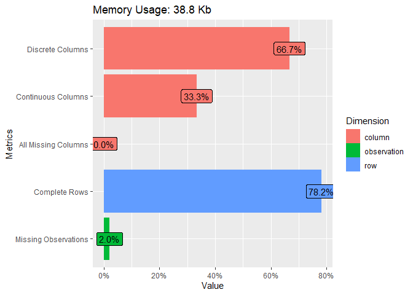<!-- -->

Above is a breakdown of the types of data and missing data. The majority
of the data available, including the response variable (Loan Status) is
discrete. 2.0% of the data is missing, and only 78.2% of the rows are
complete, indicating that missing data is spread out across and not
limited to specific observations.

``` r
plot_missing(df, 
             group = list(Good = 1), 
             theme_config = list(legend.position = c("none")))
```

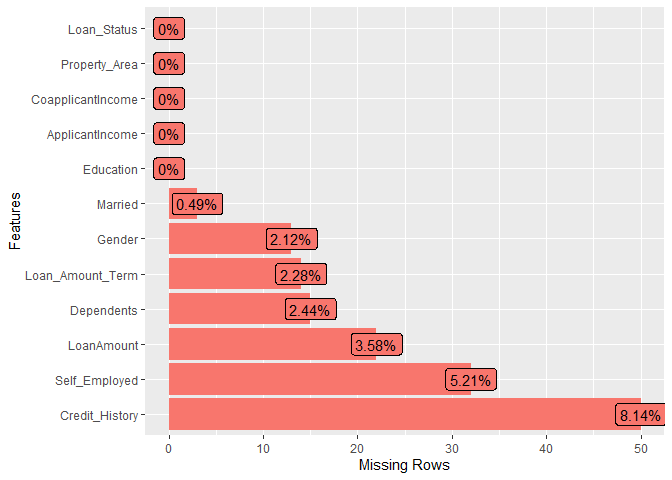<!-- -->

Above is the amount of missing data by variable. 6 of the variables have
no missing data, while the remaining have different amounts. No data
from the response variable (Loan Status) is missing. The variable with
the most missing data is Credit History.

Below we explore the relationship between the discrete variables and the
response variable.

``` r
print(paste0("Proportion of approved loans: ", round(length(which(df$Loan_Status == "Y"))/nrow(df),3)))
```

    ## [1] "Proportion of approved loans: 0.687"

``` r
plot_bar(df, by="Loan_Status", by_position="dodge") 
```

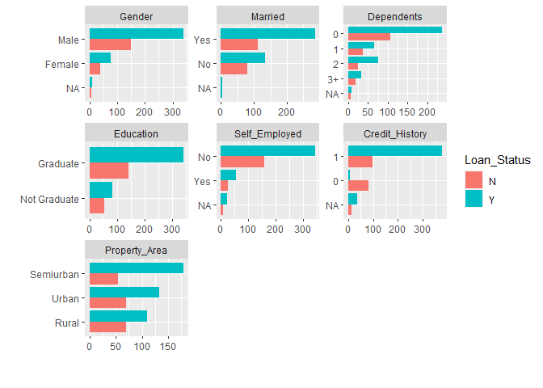<!-- -->

Above are the counts of the discrete independent variables according to
their loan status. There are a few observations one can make here.
Overall, the majority of observations have a loan status of Y
(approved). Some dependent variables seem to correlate to loan status

Gender: Males had their loans approved slightly more often than females,
and both had their loans approved slightly more than for those whom
gender was not recorded.

Married: Married individuals had their loans approved more often than
those not married. Interestingly, all cases where marriage was not
recorded had loans approved, however, there were only three observations
where marriage was not recorded, and this is likely not significant.

Dependents: Those with exactly two dependents had their loans approved
more often, while those for whom this observation was not recorded had
the lowest rate of loan approval. There is no clear trend concerning the
number of dependents and loan approval.

Education: Graduates had a higher rate of loan approval than non
graduates.

Self Employed: No difference between those self employed or not; a
slightly higher rate for those with missing data under this variable,
but this only represents \~5% of cases and is likely not significant.

Property Area: Semi-urban had a the highest rate of loan approval,
followed by Urban, with Rural having the least approvals.

Credit History: Those whose credit history met guidelines or for whom
this variable was not recorded had high rates of loan approval, while
those who did not meet guidelines had very low approval. This is the
most significant of the dependent variables.

This gives us a good overview of how the discrete variables relate to
the response. Below, we’ll examine the continuous variables and their
relationship to the response.

``` r
par(mfrow = c(2,2))

boxplot(df$LoanAmount ~ df$Loan_Status,
        xlab = "Loan Status", ylab = "Loan Amount (Thousand Dollars)", main = "Loan Amount vs Loan Status")

boxplot(df$Loan_Amount_Term ~ df$Loan_Status,
        xlab = "Loan Status", ylab = "Loan Term (Months)", main = "Loan Term vs Loan Status")

boxplot(df$ApplicantIncome ~ df$Loan_Status,
        xlab = "Loan Status", ylab = "Applicant Income", main = "Applicant Income vs Loan Status")

boxplot(df$CoapplicantIncome ~ df$Loan_Status,
        xlab = "Loan Status", ylab = "Coapplicant Income", main = "Coapplicant Income vs Loan Status")
```

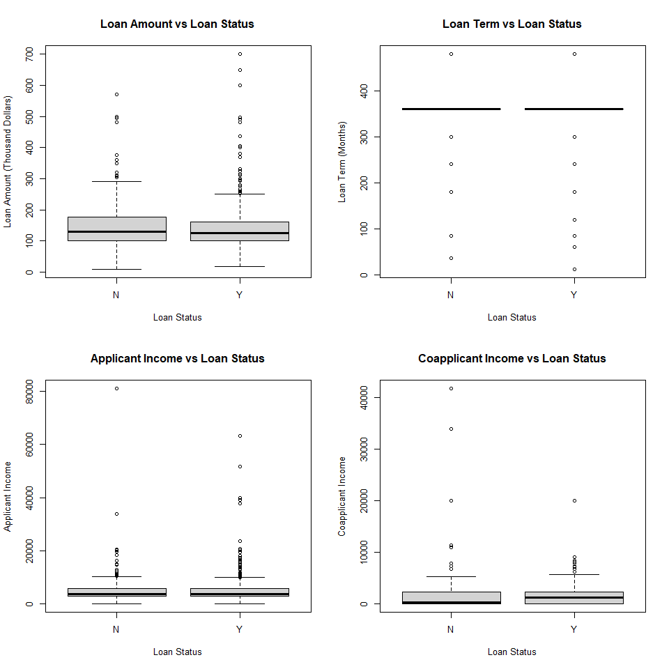<!-- -->

Above are boxplots of the continuous variables by the response variable
(Loan Status). It should be noted that most of the data (68.7%) will
fall under Loan Status = Y. That being said, we can make a few
observations.

Loan Amount: The distributions are similar, but the upper quartile is
somewhat lower among those who got their loans. This could indicate a
slight preference for those who kept their loans lower.

Loan Term: No difference between the two classes. The overwhelming
majority of applicants applied for 360 month (30 year) loans; anything
else was considered an outlier.

Applicant Income vs Loan Status: It seems like the distributions are
fairly similar. There might be more high-end outliers for those who got
their loans approved, but this could also be due to the imbalanced
response.

Co-applicant Income: The median co-applicant income for those who had
their application denied was 0, which differs significantly from those
who had their loan approved. This could indicate a preference for those
who have co-applicants with an income, and could explain why married
applicants had a higher approval rate. It should be noted however that
there was no missing data for co-applicant income, and no distinction
made between those without co-applicants and those whose co-applicants
truly had 0 income.

Let’s now see where correlations among all variables lie.

``` r
#Plots correlations.  Model matrix will help this work with categorical data (basically makes categorical into dummy variables)
plot_correlation(model.matrix(~.,na.omit(df)), type="a")
```

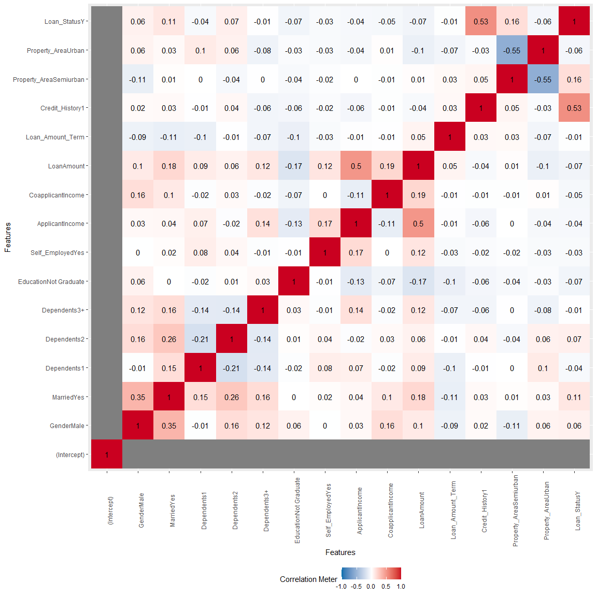<!-- -->

Above is a correlation plot between all variables. Categorical variables
were transformed into dummy variables, which excluded the first
category. Most correlations are mild at best, with a few exceptions
(outside of same-variable classes). Loan Amount is significantly
correlated (coef = 0.5) with Applicant Income; perhaps people apply for
what they think they can pay for, or need larger loans for houses in
areas with higher income. Loan Status is also significantly correlated
with Credit History (coef = 0.53). This indicates that the creditors are
more likely to approve of those who meet their credit history
guidelines, which makes alot of sense, and can be used to predict the
response variable.

Let’s now take a look at the distributions of the continuous variables,
sans Loan Term (which is almost always 360 months).

``` r
par(mfrow = c(3,1))
hist(df$ApplicantIncome, breaks = 100)
hist(df$CoapplicantIncome, breaks = 100)
hist(df$LoanAmount, breaks = 50)
```

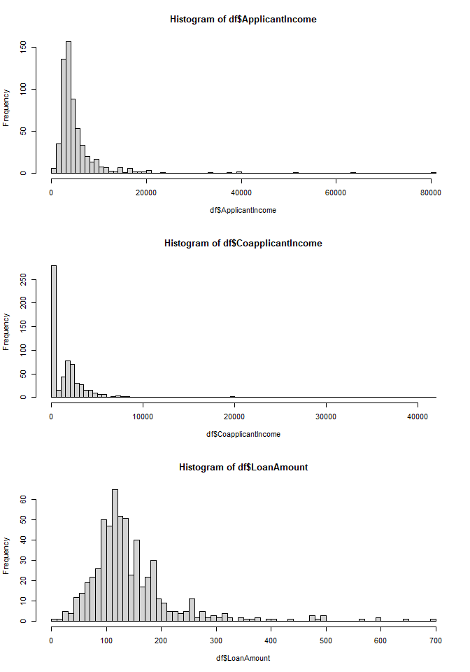<!-- -->

Both Applicant Income and Co-applicant Income are right skewed, while
Loan Amount is more normal. There are also outliers clearly present in
all three variables. Co-applicant Income is also heavily zero inflated,
an it may be worth adding another discrete variable to describe zeros
here. It may also be worth doing a log transformation on the Applicant
Income variable so it more closely approximates a normal distribution.

Let’s take a look at distributions for these variables against the
target variable.

``` r
df %>% ggplot(aes(LoanAmount, col=Loan_Status)) + geom_density()
```

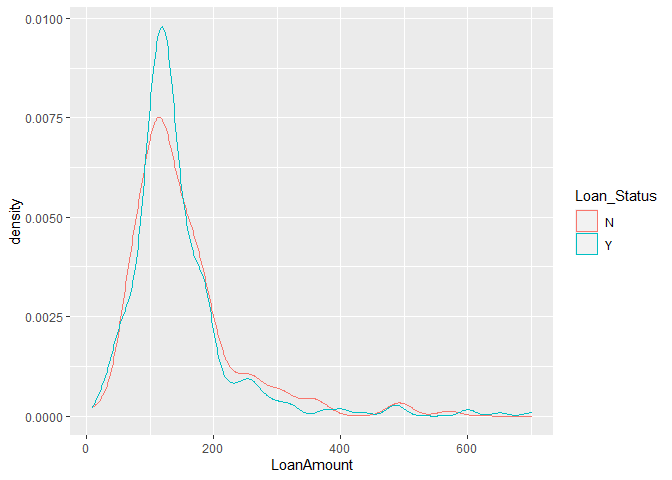<!-- -->

``` r
df %>% ggplot(aes(ApplicantIncome, col=Loan_Status)) + geom_density()
```

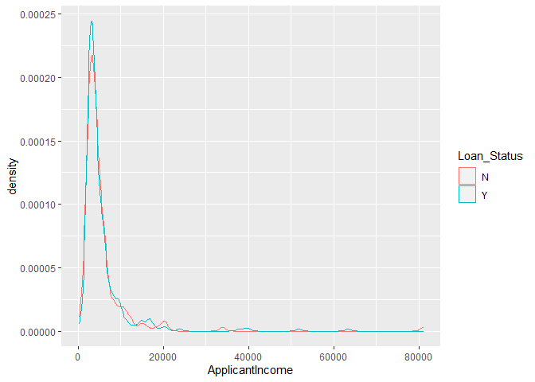<!-- -->

``` r
df %>% ggplot(aes(CoapplicantIncome, col=Loan_Status)) + geom_density()
```

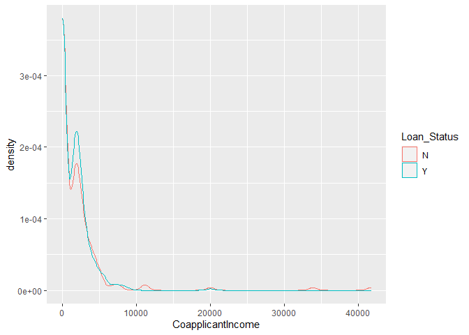<!-- -->

``` r
df %>% ggplot(aes(Loan_Amount_Term, col=Loan_Status)) + geom_density()
```

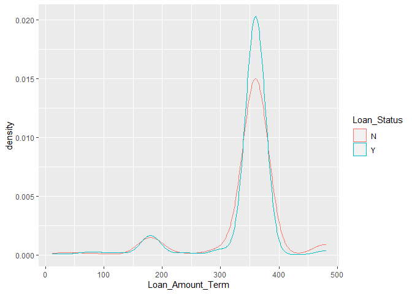<!-- -->

There are a few differences for the continuous variable distributions
when it comes to loan status. Density tends to be a bit more spread out
among those whose loans were not granted loans. It’s unclear if there is
enough difference to affect modeling.

## PreProcessing

### Feature Engineering and Transformations

Here some features and data transformations are performed. Steps that
were taken and the reasoning behind them include (in order):

Separates off a dataset specifically for LDA.

Made a variable to indicate whether or not there were dependents for the
LDA dataset. The ‘Dependents’ variable is multiclass. While it is
slightly predictive of the target, multi-class variables are
incompatible with LDA. Thus, this new variable “DEPENDENTS” was created
as a binary variable (has or does not have dependents), which can be
used with LDA.

Made ‘missing’ categories the Married, Self Employed, and Gender
variables as missing data was predictive of the target variable; this
was only done on the general dataset, as this will be incompatible with
LDA. These missing variables themselves were somewhat predictive of the
target variable, and it was desirable to retain that information instead
of imputing those values

*The next steps are applied to both datasets:*

Made a variable to indicate whether or not Co-applicant Income was zero.
Zero was a very common value for this variable, and itself proved to be
slightly predictive of the target variable.

Imputed the remaining missing values using predictive mean matching. For
the generic dataset, these missing values themselves were not predictive
of the target variable. Instead, it was deemed better to complete the
missing cases by imputing them as existing classes rather than making
new ‘missing’ classes (for discrete variables.) For the LDA dataset, we
cannot use more than two classes per variable, and thus need to impute
these to one of their two existing classes.

Centered and scaled continuous data. This is generally recommended
approach for modeling continuous data.

Removed Applicant Income and Loan Term. They were not predictive of the
target, and decreased performance on some models.

``` r
#Seperates off a dataset specificly for LDA
forLDA <- df 

#Makes a new categorical variable which indicates whether or there are dependents.  replaced the old variable
forLDA$DEPENDENTS <- factor(lapply(forLDA$Dependents, 
                          function(x) {ifelse(x!=0, "Yes", "No")}),
                   levels = c("Yes", "No"))
forLDA$Dependents <- NULL

#Make "missing" categories from NA data where appropriate
df$Gender = factor(df$Gender, levels=c(levels(df$Gender), "Missing"))
df$Gender[is.na(df$Gender)] = "Missing"

df$Married = factor(df$Married, levels=c(levels(df$Married), "Missing"))
df$Married[is.na(df$Married)] = "Missing"

df$Self_Employed = factor(df$Self_Employed, levels=c(levels(df$Self_Employed), "Missing"))
df$Self_Employed[is.na(df$Self_Employed)] = "Missing"
  
  
#Wraps the next
process <- function(df) {
  
  
  
  #Makes a new categorical variable which indicates whether or not Coapplicant Income is 0 or not
  df$Coap0 <- factor(lapply(df$CoapplicantIncome, 
                            function(x) {ifelse(x==0, "zero", "positive")}),
                     levels = c("zero", "positive"))
  
  
                     
  #Imputes remaining missing values            
  impute_temp <- mice(df,
                  m = 5,
                  method = "pmm",
                  maxit = 5,
                  seed = 2021,
                  )
  
  imputed <- complete(impute_temp)
  
  
  
  
  
  #Centers and scales the data where appropriate
  process <- preProcess(x = imputed,
                       method = c("center", "scale"))
  
  processed <- predict(process, imputed)
  
  
  #Removes variables that aren't significanly correlated to the target
  #I tested the models with and without these, and accuracy either increased or stayed the same when these were removed
  processed$Loan_Amount_Term <- NULL
  processed$ApplicantIncome <- NULL

  return(processed)
}

forLDA <- process(forLDA)

processed <- process(df)
```

### Train/Test Split

It is desirable to have a holdout dataset to evaluate the models. Below,
20% of the dataset is split off into a test set, while the remaining 80%
becomes the training set (the models are trained on this). This is done
for both datasets

``` r
set.seed(2021)
trainIndex <- createDataPartition(processed$Loan_Status, p = .8) %>% unlist()
training <- processed[ trainIndex,]
testing  <- processed[-trainIndex,]

LDAtrainIndex <- createDataPartition(forLDA$Loan_Status, p = .8) %>% unlist()
LDAtraining <- forLDA[ trainIndex,]
LDAtesting  <- forLDA[-trainIndex,]
```

### Cross Validation Setup

Ten-fold cross validation is used as an aid in model training; this is
seperate from the holdout testing set, which will be used solely for
model evaluation at the end of training.

``` r
# 10 fold cv
ctrl <- trainControl(method="repeatedcv",
                     number=10)
```

## Model Training

Four classification models, Linear Discriminant Analysis (LDA),
K-Nearest Neighbors (KNN), a single decision tree, and Random Forest are
built to classify new cases as a loan that is either approved or is not
approved, based on the predictor variables. For each model, a brief
discussion regarding pre-processing is provided, as are performance
statistics summarizing predictions made on the test data set. There is a
class imbalance present (albeit not extreme) in the target - 68% of loan
applications have been approved- which is taken as the no information
rate. Loan Status=N is considered to be the positive case for the
analysis. The sensitivity will assess the true positive rate - the
ability of the model to correctly predict loans that were not approved.
The specificity is designated as the true negative rate - the ability of
the model to correctly predict loans that were approved. Where
applicable, the optimization of hyper-parameters through grid search
will be presented graphically.

### 1. Linear Discriminant Analysis

Below, Linear Discriminate Analysis (LDA) is used to attempt to predict
the target class (Loan Status). Variables were selected primarily by
their correlation to the target. Many transformations were performed,
the reasons for which are explained in the `PreProcessing` section.
Specific to this model however, the ‘Dependents’ variable was excluded
because it is multi-class, and therefore incompatible with LDA. It was
replaced with the binary “DEPENDENTS’ variable. Missing data from more
variables was imputed instead of using a ‘missing’ class for the same
reason. There were no hyper-parameters to tune for the LDA model. The
LDA correctly predicted 79.5% of loan statuses in the test set, which
offered statistically significant improvement compared to no the
no-information rate (p-value = 0.0059). The model was far better at
predicting true negatives (approved loans) than at predicting true
positives (denied loans).

``` r
#Technically works with binary classes
#Caret appears to remove non-binary discrete variables automatically

lda.fit <- train(Loan_Status ~ ., data=LDAtraining, 
                 method="lda",
                 metric="Accuracy",
                 trControl=ctrl)

lda.predict <- predict(lda.fit, LDAtesting)

confusionMatrix(lda.predict, LDAtesting$Loan_Status)
```

    ## Confusion Matrix and Statistics
    ## 
    ##           Reference
    ## Prediction  N  Y
    ##          N 17  4
    ##          Y 21 80
    ##                                           
    ##                Accuracy : 0.7951          
    ##                  95% CI : (0.7125, 0.8628)
    ##     No Information Rate : 0.6885          
    ##     P-Value [Acc > NIR] : 0.005850        
    ##                                           
    ##                   Kappa : 0.4556          
    ##                                           
    ##  Mcnemar's Test P-Value : 0.001374        
    ##                                           
    ##             Sensitivity : 0.4474          
    ##             Specificity : 0.9524          
    ##          Pos Pred Value : 0.8095          
    ##          Neg Pred Value : 0.7921          
    ##              Prevalence : 0.3115          
    ##          Detection Rate : 0.1393          
    ##    Detection Prevalence : 0.1721          
    ##       Balanced Accuracy : 0.6999          
    ##                                           
    ##        'Positive' Class : N               
    ## 

### 2. K-Nearest Neighbors

Below a K-Nearest Neighbors (KNN) model is created. The data preparation
is thoroughly explained in the pre-processing section, but to summarize,
‘missing’ classes were made for some variables, further missing data was
imputed, non-predictive variables were removed (which significantly
improved the accuracy of this model specifically), and continuous
variables were centered and scaled. The only hyper-parameter tuned here
was K: the number of nearest neighbors taken into consideration. Grid
search was used to find the best value of k, which was 12. The KNN model
also performed significantly better than the no information rate, but
for this model lower end of the 95% confidence interval is approaching
the no-information rate. Again, there was a disproportionately high
number of false positives in the KNN model- possibly due to class
imbalance of the target causing a bias towards the majority class
(Loan_Status=Y).

``` r
set.seed(2021) #Otherwise it's somthing different each time

tune = expand.grid(.k = 1:35)


knn.fit <- train(Loan_Status ~ ., data=training, 
                 method="knn",
                 metric="Accuracy",
                 tuneGrid=tune,
                 trControl=ctrl)

knn.predict <- predict(knn.fit, testing)
plot(knn.fit)
```

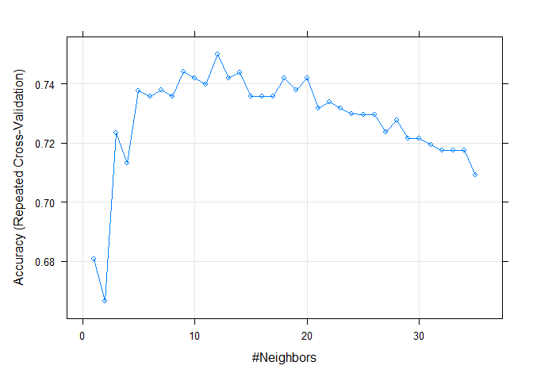<!-- -->

``` r
confusionMatrix(knn.predict, testing$Loan_Status)
```

    ## Confusion Matrix and Statistics
    ## 
    ##           Reference
    ## Prediction  N  Y
    ##          N 12  2
    ##          Y 26 82
    ##                                           
    ##                Accuracy : 0.7705          
    ##                  95% CI : (0.6857, 0.8418)
    ##     No Information Rate : 0.6885          
    ##     P-Value [Acc > NIR] : 0.02916         
    ##                                           
    ##                   Kappa : 0.353           
    ##                                           
    ##  Mcnemar's Test P-Value : 1.383e-05       
    ##                                           
    ##             Sensitivity : 0.31579         
    ##             Specificity : 0.97619         
    ##          Pos Pred Value : 0.85714         
    ##          Neg Pred Value : 0.75926         
    ##              Prevalence : 0.31148         
    ##          Detection Rate : 0.09836         
    ##    Detection Prevalence : 0.11475         
    ##       Balanced Accuracy : 0.64599         
    ##                                           
    ##        'Positive' Class : N               
    ## 

``` r
# knnFit$pred <- merge(knnFit$pred, knnFit$bestTune)
# knnRoc <- roc(response = knnFit$pred$obs,
#               predictor=knnFit$pred$successful,
#               levels= rev(levels(knnFit$pred$obs)))
# 
# plot(knnRoc, legacy.axes=T)
```

### 3. Decision Tree

Here a single decision tree was created. The data used here was the same
as used with the KNN model. The only hyper-parameter to tune here was
the complexity parameter; this basically controls the size of the tree.
It was determined via grid search that any complexity parameter between
0.02 and 0.4 performed equally well. The metrics of the decision tree
show improvement over the previous models - the accuracy rate exceeds
81% and the model ability to detect denied loans is up.

``` r
set.seed(2021)

grid = expand.grid(.cp = seq(0,0.5,0.01))
tree.fit <- train(Loan_Status ~ ., data=training, 
                  method="rpart",
                  metric="Accuracy",
                  preProc=c("center","scale"),  
                  tuneGrid = grid,
                  trControl=ctrl)


tree.predict <- predict(tree.fit, testing)
plot(tree.fit)
```

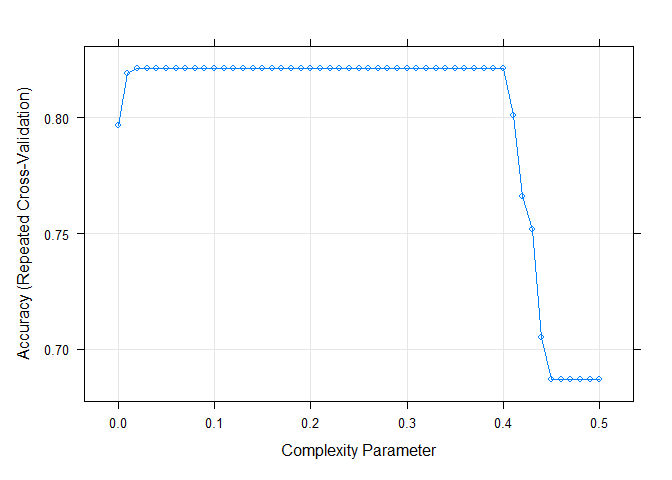<!-- -->

``` r
confusionMatrix(tree.predict, testing$Loan_Status)
```

    ## Confusion Matrix and Statistics
    ## 
    ##           Reference
    ## Prediction  N  Y
    ##          N 18  3
    ##          Y 20 81
    ##                                           
    ##                Accuracy : 0.8115          
    ##                  95% CI : (0.7307, 0.8766)
    ##     No Information Rate : 0.6885          
    ##     P-Value [Acc > NIR] : 0.0015969       
    ##                                           
    ##                   Kappa : 0.4991          
    ##                                           
    ##  Mcnemar's Test P-Value : 0.0008492       
    ##                                           
    ##             Sensitivity : 0.4737          
    ##             Specificity : 0.9643          
    ##          Pos Pred Value : 0.8571          
    ##          Neg Pred Value : 0.8020          
    ##              Prevalence : 0.3115          
    ##          Detection Rate : 0.1475          
    ##    Detection Prevalence : 0.1721          
    ##       Balanced Accuracy : 0.7190          
    ##                                           
    ##        'Positive' Class : N               
    ## 

### 4. Random Forest

Below a random forest model is created. The dataset used here is the
same as was used for the KNN and single decision tree models. The only
hyper-parameter here was mtry: the number of randomly selected
predictors. This was chosen via grid-search; two performed the best. It
should be noted that caret will use 500 trees automatically with this
function; it does not consider this parameter worth tuning as 500 should
approach the maximum performance among all possible numbers of trees.
The random forest model results are the same as the single decision
tree.

``` r
set.seed(2021)
grid = expand.grid(.mtry = 0:20)

rf.fit <- train(Loan_Status ~ ., data=training, 
                method="rf",
                metric="Accuracy",
                tuneGrid = grid,
                trControl=ctrl)

rf.predict <- predict(rf.fit, testing)

plot(rf.fit)
```

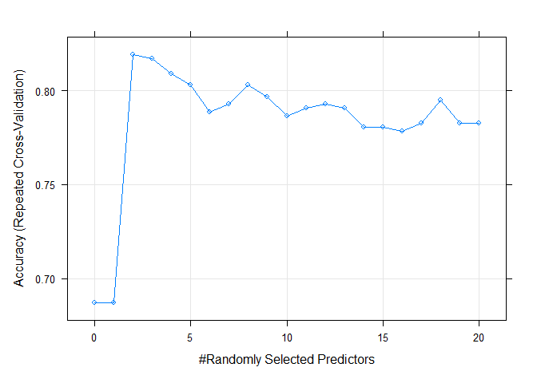<!-- -->

``` r
confusionMatrix(rf.predict, testing$Loan_Status)
```

    ## Confusion Matrix and Statistics
    ## 
    ##           Reference
    ## Prediction  N  Y
    ##          N 18  3
    ##          Y 20 81
    ##                                           
    ##                Accuracy : 0.8115          
    ##                  95% CI : (0.7307, 0.8766)
    ##     No Information Rate : 0.6885          
    ##     P-Value [Acc > NIR] : 0.0015969       
    ##                                           
    ##                   Kappa : 0.4991          
    ##                                           
    ##  Mcnemar's Test P-Value : 0.0008492       
    ##                                           
    ##             Sensitivity : 0.4737          
    ##             Specificity : 0.9643          
    ##          Pos Pred Value : 0.8571          
    ##          Neg Pred Value : 0.8020          
    ##              Prevalence : 0.3115          
    ##          Detection Rate : 0.1475          
    ##    Detection Prevalence : 0.1721          
    ##       Balanced Accuracy : 0.7190          
    ##                                           
    ##        'Positive' Class : N               
    ## 

``` r
#plot(rf.fit)
#rf.fit$finalModel
```

## Comparison of Results

After building the four models and analyzing the results, their relative
performance is now directly compared in the table below. The main
metrics used to make comparisons are Accuracy, Kappa, and Sensitivity.
Sensitivity takes priority over Specificity - being able to predict
which loans will be denied can help decision makers identify risky loan
applicants. The kappa statistic is a measure of how well the model
prediction matched the labeled test set, while controlling for the
accuracy that would have been produced by a random classifier. As a
stand alone metric, kappa can be difficult to interpret, but is useful
for between model comparisons.

In terms of overall accuracy and kappa, oth single decision tree and
random forest models performed the best and exceeded 80% accuracy on the
test set, and out performed the other models in the kappa statistic by
at least 4 percentage points. The single decision tree model is also
quite easily interperetable. The high relative performance of the the
single decision tree was a surprising result, performing as well as the
bootstrap aggregated tree model. However, if the purpose of this
classifier is to identify potentially bad loans, then choosing the model
with the highest sensitivity rate should take precedence; in this case,
either would work.

### Table of Performance Metrics

``` r
data.frame(lda=c(postResample(lda.predict, testing$Loan_Status), Sensitivity=sensitivity(lda.predict,testing$Loan_Status)),
           knn=c(postResample(knn.predict, testing$Loan_Status), Sensitivity=sensitivity(knn.predict,testing$Loan_Status)),
           tree=c(postResample(tree.predict, testing$Loan_Status), Sensitivity=sensitivity(tree.predict,testing$Loan_Status)),
           rf=c(postResample(rf.predict, testing$Loan_Status),Sensitivity=sensitivity(rf.predict,testing$Loan_Status))
) 
```

    ##                   lda       knn      tree        rf
    ## Accuracy    0.7950820 0.7704918 0.8114754 0.8114754
    ## Kappa       0.4555516 0.3530303 0.4991075 0.4991075
    ## Sensitivity 0.4473684 0.3157895 0.4736842 0.4736842

``` r
#fancyRpartPlot(tree.fit$finalModel)
```

Lastly, each model is evaluated in terms of how much the predictors
contributed to the model. As seen in the graphs below, and the decision
tree above, the tree was a very simple model, using only credit history
as basis for classification. Credit history was the most important for
all models; this is unsurprising, considering this metric is
specifically designed to discriminate between loan applicants.
Identifying other important variables could be useful information in
guiding future modelling efforts and data collection.

### Varaible Importance

``` r
par(mfrow = c(2, 2))
varImp(lda.fit) %>% plot(main="LDA Variable Importance")
```

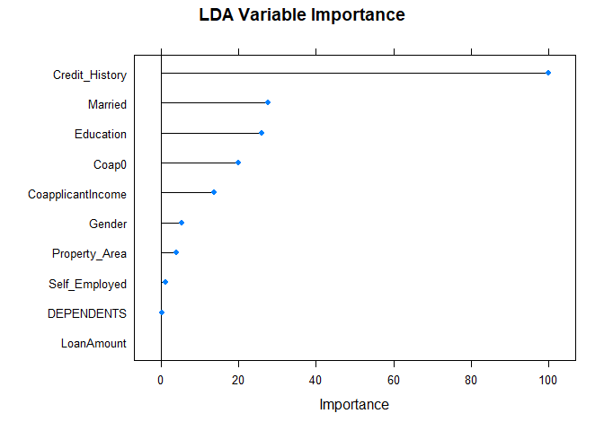<!-- -->

``` r
varImp(knn.fit) %>% plot(main="KNN Variable Importance")
```

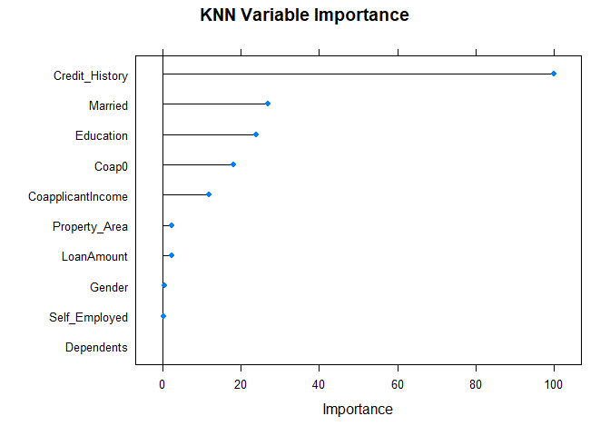<!-- -->

``` r
varImp(tree.fit)%>% plot(main="Decision Tree Variable Importance")
```

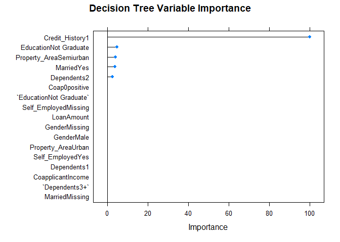<!-- -->

``` r
varImp(rf.fit)%>% plot(main="Random Forest Variable Importance")
```

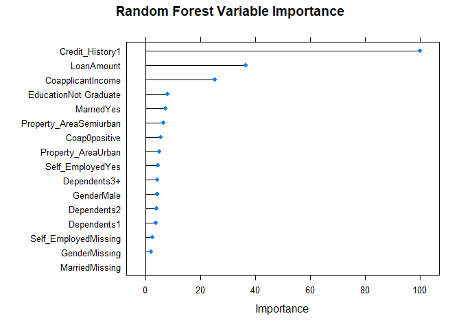<!-- -->
