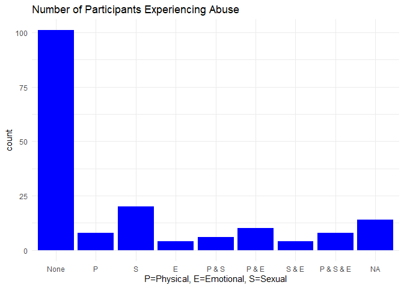

Mental Health Clustering and Suicide Prediction
================
David Blumenstiel and Robert Welk
10/30/2021

# Purpose

*For this assignment, we will be working with a very interesting mental
health dataset from a real-life research project. All identifying
information, of course, has been removed. The attached spreadsheet has
the data (the tab name “Data”). The data dictionary is given in the
second tab. You can get as creative as you want. The assignment is
designed to really get you to think about how you could use different
methods.*

The provided mental health dataset was uploaded to GitHub for ease of
access and reproducability. First, it was imported into a dataframe.

``` r
#packages
library(DataExplorer)
library(tidyverse)
library(corrplot)
library(scales)
library(mice)
library(caret)
library(GGally)
library(viridis)
library(plotly)
library(ggdendro)
library(ggpubr)
library(cluster)
library("dendextend")

df <- read.csv("https://raw.githubusercontent.com/davidblumenstiel/Portfolio_2022/main/Mental%20Health%20and%20Suicide%20Analysis%20and%20Modeling/data/ADHD_data.csv", na.string="") # %>% as_tibble()
colnames(df)[1] <- "Initial" 
```

# Exploratory Data Analysis

*Conduct a thorough Exploratory Data Analysis (EDA) to understand the
dataset. (20 points)*

## Data Overview

There are 54 variables in the raw dataset.

**Data Dictionary**

-Sex: Male-1, Female-2

-Race: White-1, African American-2, Hispanic-3, Asian-4, Native
American-5, Other or missing data -6

-ADHD self-report scale (multiple variables): Never-0, rarely-1,
sometimes-2, often-3, very often-4

-Mood disorder questions(multiple variables): No-0, yes-1; question 3:
no problem-0, minor-1, moderate-2, serious-3

-Individual substances misuse(multiple variables): no use-0, use-1,
abuse-2, dependence-3

-Court Order: No-0, Yes-1

-Education: 1-12 grade, 13+ college

-History of Violence: No-0, Yes-1

-Disorderly Conduct: No-0, Yes-1

-Suicide attempt: No-0, Yes-1

-Abuse Hx: No-0, Physical (P)-1, Sexual (S)-2, Emotional (E)-3, P&S-4,
P&E-5, S&E-6, P&S&E-7

-Non-substance-related Dx: 0 – none; 1 – one; 2 – More than one

-Substance-related Dx: 0 – none; 1 – one Substance-related; 2 – two; 3 –
three or more

-Psychiatric Meds: 0 – none; 1 – one psychotropic med; 2 – more than one
psychotropic med

Below are a couple basic plots of the dataset as a whole.

``` r
# overview of data
str(df)
```

    ## 'data.frame':    175 obs. of  54 variables:
    ##  $ Initial           : chr  "JA" "LA" "MD" "RD" ...
    ##  $ Age               : int  24 48 51 43 34 39 41 48 44 27 ...
    ##  $ Sex               : int  1 2 2 1 1 2 2 1 2 2 ...
    ##  $ Race              : int  1 1 1 1 1 1 1 1 1 1 ...
    ##  $ ADHD.Q1           : int  1 3 2 3 4 2 2 2 3 2 ...
    ##  $ ADHD.Q2           : int  1 3 1 3 4 3 2 4 3 3 ...
    ##  $ ADHD.Q3           : int  4 4 2 2 2 1 1 3 3 4 ...
    ##  $ ADHD.Q4           : int  2 4 1 2 4 4 3 4 4 4 ...
    ##  $ ADHD.Q5           : int  3 5 3 4 4 3 4 3 4 4 ...
    ##  $ ADHD.Q6           : int  1 2 3 3 2 2 4 3 3 3 ...
    ##  $ ADHD.Q7           : int  1 2 3 2 3 3 2 1 3 4 ...
    ##  $ ADHD.Q8           : int  3 3 2 4 4 4 3 1 4 3 ...
    ##  $ ADHD.Q9           : int  2 2 0 4 4 4 3 4 3 2 ...
    ##  $ ADHD.Q10          : int  4 4 1 2 2 2 4 2 4 4 ...
    ##  $ ADHD.Q11          : int  2 1 2 3 4 4 3 4 3 3 ...
    ##  $ ADHD.Q12          : int  4 4 0 1 1 2 1 1 0 1 ...
    ##  $ ADHD.Q13          : int  1 2 2 3 3 4 4 4 4 3 ...
    ##  $ ADHD.Q14          : int  0 4 2 3 2 4 4 3 3 4 ...
    ##  $ ADHD.Q15          : int  3 4 3 1 1 3 4 0 3 4 ...
    ##  $ ADHD.Q16          : int  1 3 2 2 2 4 4 0 2 4 ...
    ##  $ ADHD.Q17          : int  3 1 1 1 1 3 2 1 4 2 ...
    ##  $ ADHD.Q18          : int  4 4 1 2 1 3 4 1 3 2 ...
    ##  $ ADHD.Total        : int  40 55 31 45 48 55 54 41 56 56 ...
    ##  $ MD.Q1a            : int  1 1 0 1 0 0 1 0 1 1 ...
    ##  $ MD.Q1b            : int  1 1 0 1 1 1 1 0 1 1 ...
    ##  $ MD.Q1c            : int  1 1 0 0 0 0 0 0 0 0 ...
    ##  $ MD.Q1d            : int  1 1 0 0 1 1 0 0 1 0 ...
    ##  $ MD.Q1e            : int  0 1 1 1 0 1 1 0 1 1 ...
    ##  $ MD.Q1f            : int  1 1 1 1 1 1 1 1 1 0 ...
    ##  $ MD.Q1g            : int  1 1 1 1 1 1 0 1 1 1 ...
    ##  $ MD.Q1h            : int  1 1 0 1 0 1 0 0 0 0 ...
    ##  $ MD.Q1i            : int  1 1 0 1 0 1 0 0 0 0 ...
    ##  $ MD.Q1j            : int  1 0 0 0 0 1 0 0 0 1 ...
    ##  $ MD.Q1k            : int  1 0 0 0 0 1 0 0 0 1 ...
    ##  $ MD.Q1L            : int  0 1 0 1 0 1 1 1 1 1 ...
    ##  $ MD.Q1m            : int  1 0 0 1 0 0 0 0 1 1 ...
    ##  $ MD.Q2             : int  1 1 0 1 1 1 1 1 1 1 ...
    ##  $ MD.Q3             : int  3 3 2 3 2 3 3 3 3 2 ...
    ##  $ MD.TOTAL          : int  15 14 5 13 7 14 9 7 12 11 ...
    ##  $ Alcohol           : int  1 0 0 1 1 1 3 0 1 0 ...
    ##  $ THC               : int  1 0 0 1 1 0 3 0 0 3 ...
    ##  $ Cocaine           : int  1 0 0 1 0 0 1 0 0 0 ...
    ##  $ Stimulants        : int  0 0 0 1 0 0 1 0 0 0 ...
    ##  $ Sedative.hypnotics: int  0 0 0 0 0 0 1 0 0 0 ...
    ##  $ Opioids           : int  0 0 0 0 0 0 0 0 1 0 ...
    ##  $ Court.order       : int  1 0 0 0 1 0 0 0 0 0 ...
    ##  $ Education         : int  11 14 12 12 9 11 12 16 12 9 ...
    ##  $ Hx.of.Violence    : int  0 0 0 0 1 0 1 1 1 0 ...
    ##  $ Disorderly.Conduct: int  1 0 0 0 1 1 1 1 1 1 ...
    ##  $ Suicide           : int  1 1 0 1 1 1 0 0 0 0 ...
    ##  $ Abuse             : int  0 4 6 7 0 2 4 0 0 2 ...
    ##  $ Non.subst.Dx      : int  2 1 2 2 2 0 1 2 1 1 ...
    ##  $ Subst.Dx          : int  0 0 0 0 0 0 0 1 0 2 ...
    ##  $ Psych.meds.       : int  2 1 1 2 0 0 1 2 1 0 ...

``` r
introduce(df)
```

    ##   rows columns discrete_columns continuous_columns all_missing_columns
    ## 1  175      54                1                 53                   0
    ##   total_missing_values complete_rows total_observations memory_usage
    ## 1                  250            55               9450        56104

Above is a quick breakdown of the different variables. Except for the
Initial variable (which will be removed prior to modeling), every
variable is an integer (continuous). This doesn’t make too much sense
for many of these variables, such as the ADHD and MD self report
questions. While such variables often progress in the same direction
(1\<2\<3), there is no real scale; these variables would be better
described as categorical.

When it comes to missing data, most variables are completely intact,
while only one variable (Psych Meds) is missing a significant amount
(67%). Missing data will later be imputed.

## 1. Demographics

Below is an basic exploration of some demographic information: Age, Sex,
Race, and Education.

``` r
#table(df$Sex)
# variables that can be categorized as demographics
demographics <- c('Age', 'Race', 'Sex', 'Education')

# summary of demographics
df %>% dplyr::select(all_of(demographics)) %>%  summary() 
```

    ##       Age             Race           Sex          Education   
    ##  Min.   :18.00   Min.   :1.00   Min.   :1.000   Min.   : 6.0  
    ##  1st Qu.:29.50   1st Qu.:1.00   1st Qu.:1.000   1st Qu.:11.0  
    ##  Median :42.00   Median :2.00   Median :1.000   Median :12.0  
    ##  Mean   :39.47   Mean   :1.64   Mean   :1.434   Mean   :11.9  
    ##  3rd Qu.:48.00   3rd Qu.:2.00   3rd Qu.:2.000   3rd Qu.:13.0  
    ##  Max.   :69.00   Max.   :6.00   Max.   :2.000   Max.   :19.0  
    ##                                                 NA's   :9

``` r
#df %>% dplyr::select(all_of(demographics)) %>%  str


# get counts of each group 
df %>% 
  dplyr::select(all_of(demographics), Initial) %>% 
  pivot_longer(-Initial) %>% 
  ggplot(aes(x=value)) + 
  geom_bar(stat="count", fill="blue") + 
  facet_wrap(~name, scales="free") + 
  theme_minimal()
```

<!-- -->

``` r
# Replace 2 (female) to 0 so that range is from 0 to 1
df$Sex[df$Sex==2] <- 0
```

*Age, Sex, Race, and Education*

-   Ages range from 18 to 69 with a median of 42. This is older than the
    median age of the US population, 38 years, likely because this
    dataset excludes children (dataset >= 18 years).
-   12 years of education, high school completion, is the most common
    level of educational attainment. More participants had not completed
    high school than had a college education. Education levels ranged
    from 6 years to 19 years.
-   African Americans were the most common ethnic group (100) followed
    by White (72). Other ethnic groups had few participants (3)
-   There were more males (99) than females (76) in this dataset.

## 2. ADHD self-report

The raster plot below shows an aggregation of the number of counts for
each question/response pair for the ADHD set.

``` r
# fix the invalid entry 
df$ADHD.Q5[df$ADHD.Q5==5] <- 4
# raster plot of response counts
df %>% 
  dplyr::select(starts_with('ADHD')) %>% 
  pivot_longer(-ADHD.Total) %>%
  group_by(name) %>% 
  count(val=factor(value)) %>% 
  ggplot(aes(x=as.factor(name),y=val,fill=n)) + 
  #geom_point(size=5)+ 
  geom_raster() +
  scale_fill_viridis_c(option = "plasma") +
  labs(y="",x="", title="Raster plot summarizing counts of ADHD questions")+
  scale_y_discrete(labels=c("1 - Never","2 - rarely","3 - sometimes","4 - often","5 - very often")) + 
  theme_minimal() +
    theme(axis.text.x = element_text(angle = -90))
```

<!-- -->

-   Q.12 had responses that are different from the rest
-   Q.7 had many one and twos
-   Q.5 had an invalid entry (5) which was assumed to be (4) and
    replaced prior to plotting

## 3. Mood Disorder self-report

The raster plot below shows and aggregation of number of counts for each
question/response pair for the mood disorder set.

``` r
df %>% 
  dplyr::select(starts_with('MD')) %>% 
  pivot_longer(-MD.TOTAL) %>%
  group_by(name) %>% 
  count(val=factor(value)) %>% 
  ggplot(aes(x=as.factor(name),y=val,fill=n)) + 
  #geom_point(size=5)+ 
  geom_raster() +
  scale_fill_viridis_c(option = "plasma") +
  labs(y="",x="", title="Raster plot summarizing counts of Mood Disorder questions")+
  scale_y_discrete(labels=c("No (Q3:no problem)","Yes (Q3:minor)","Q3: moderate","Q3: serious")) + 
  theme_minimal() +
    theme(axis.text.x = element_text(angle = -90))
```

<!-- -->

-   For Questions 1 and 2, participants were more likely to respond no
    than yes
-   For Question 3, serious effects were more common that minor or no
    effects

Below is a density plot of the ADHD Total and MD Total variables; the
cumulative score of all questions for both categories for each
individual.

``` r
# find the distribution of score
df %>%
  select(MD.TOTAL,ADHD.Total) %>% 
  pivot_longer(everything()) %>% 
  ggplot(aes(value))+
           geom_density(alpha=.5, fill="blue") + 
           facet_wrap(~name, scale="free") +
           labs(x="Cumulative score for question set", title="Density of ADHD and Mood Disorder total scores")+  
  theme_minimal()
```

<!-- -->

-   The distribution of ADHD Total is somewhat Gaussian (if perhaps a
    little right skewed), with a mean of 34.3 and a standard deviation
    of 16.7.
-   This variable will likely be valuable for representing relative ADHD
    severity
-   The MD Total variable is fairly left skewed, with individuals on the
    whole tending to report highly on the MD questions.  
-   This variable has a median of 11, and an IQR of 7.5.

## 4. Drug Use

Below is a plot of the 6 substance usage questions. Each substance is
represented by a bar proportioned by how individuals use the substance.

*Substance Usage*

no use-0, use-1, abuse-2, dependence-3

``` r
na.omit(df[,40:45]) %>% 
  dplyr::select(Alcohol, THC,Cocaine,Stimulants, Sedative.hypnotics,Opioids) %>% 
  pivot_longer(everything()) %>% 
  ggplot(aes(x=name,fill=as.factor(value))) + 
  geom_bar(position = "fill") + 
  scale_fill_viridis_d(name="Drug Usage", labels=c("None","Use", "Abuse","Dependence" ),option="plasma") + 
  theme_minimal() +
  labs(x="",y='Percentage of use',title="Percent Usage by Drug Type")+
  scale_y_continuous(labels = scales::percent) 
```

<!-- -->

``` r
q <- na.omit(df[,40:45])
q$DRUG_abuse <- as.integer(apply(q >= 2, 1, any))  #Drug abusers
q <- sum(q$DRUG_abuse)/length(q$DRUG_abuse)
```

-   The most frequent response for all substances was ‘no use’, except
    for alcohol, which most of the participants had some level of usage
-   Individuals were more likely to report dependence rather than use or
    abuse
-   Alcohol was the most commonly abused/dependent drug, followed by
    Cocaine, then THC
-   76.6% of participants reported either abuse or dependence of one or
    more of these drugs. This seems rather high.

## 5. Legal Issues

Below are figures pertaining to ‘legal issues’: court orders, disorderly
conduct, and history of violence

``` r
# df %>% 
#   dplyr::select(Court.order, Disorderly.Conduct, Hx.of.Violence ,Initial) %>% 
#     pivot_longer(-c(Initial)) %>% 
#   group_by(name, value) %>% 
#   summarize(number=n()) 

df %>% 
  dplyr::select(Court.order, Disorderly.Conduct, Hx.of.Violence) %>% 
  pivot_longer(everything()) %>% 
  ggplot(aes(x=name,fill=as.factor(value))) + 
  geom_bar(position = "fill") + 
  scale_fill_viridis_d(name="", labels=c("No","Yes"),option="plasma") + 
  theme_minimal() +
  labs(x="",y='Percentage', title="Percentage of Participants with Leagal Issues") +
  scale_y_continuous(labels = scales::percent)
```

<!-- -->

-   Disorderly conduct was the most common legal issue with 119 of
    participants having one
-   There were relatively few court orders (15)
-   40 had a history of violence

## 6. Abuse

Below is a bar-plot of abuse. This is a categorical variable with values
referencing different types of abuse. These values follow as:

No-0, Physical (P)-1, Sexual (S)-2, Emotional (E)-3, P&S-4, P&E-5,
S&E-6, P&S&E-7

``` r
df %>% 
  dplyr::select(Abuse) %>% 
  mutate(Abuse=factor(Abuse)) %>% 
  ggplot(aes(Abuse)) +
  geom_bar(stat="count", fill="blue") + 
  scale_x_discrete(labels=c("None", "P", "S", "E", "P & S", "P & E", "S & E", "P & S & E")) + 
  theme_minimal() + 
  labs(x="P=Physical, E=Emotional, S=Sexual", title="Number of Participants Experiencing Abuse")
```

<!-- -->

-   Most participants (101) had no history of abuse
-   Sexual abuse was the second most common, followed by physical and
    emotional > physical > physical, emotional, and sexual

## 7. Medical Interventions

Below, the prevalence of substance and non-substance related diagnoses,
along with (prescription) psychotropic medications are explored.

``` r
df %>% 
  dplyr::select(Subst.Dx,Non.subst.Dx,Psych.meds. ) %>% 
  pivot_longer(everything()) %>% 
  ggplot(aes(x=name,fill=as.factor(value))) + 
  geom_bar(position="dodge") + 
  scale_fill_viridis_d(name="Number of Interventions", labels=c("None","One","Two", "Two or More"),option="plasma") + 
  theme_minimal() +
  labs(x="Type of Medical Intervention",y='Count',title="Number of Participants with Medical Interventions")
```

<!-- -->

-   Most participants had a substance diagnosis, many had 2 or more
-   Most participants did not had a non substance diagnosis
-   Participants were almost as likely to use 0, 1, or more than 1
    psychotropic drugs, although the majority of the data is missing for
    this variable

## 8. Suicide

Suicide is the target variable for the the supervised learning section
later on. Below, there are several different figures examining suicide
attempts in respect to several different variables:

First we investigate how self-report relates to suicide. There is a
scatter-plot of MD and ADHD totals colored by Suicide. Combinations of
self-report associated with suicide attempt can be inferred. Also
included are two bar-plots for the individual questions. For these
figures, aggregate counts by groups of questions and responses was
calculated as was the percentage of each group that had a suicide
attempt. The top ten highest question/response pairs in terms of
associated suicide attempt rate are given for the both the ADHD and Mood
Disorder questionnaires.

``` r
# ADHD and MD
df %>%
  filter(!is.na(Suicide)) %>% 
  ggplot(aes(x=ADHD.Total, y=MD.TOTAL, col=factor(Suicide))) + 
  geom_point(size=2) + 
  scale_color_viridis_d(name="Suicide Attempt", labels=c("No","Yes"),option="plasma") + 
  labs(x="ADHD Total Score", y="Mood Disorder Total Score", title="Scatter-plot of Mood Disorder Score vs ADHD Total Score with Suicide Attempts") + 
  theme_minimal()
```

<!-- -->

``` r
# which questions/response pairs were most associated with suicide
df %>% 
    filter(!is.na(Suicide)) %>% 
  dplyr::select(starts_with('ADHD.Q'),Suicide) %>% 
  pivot_longer(-Suicide) %>%
  group_by(name,Suicide) %>% 
  count(val=factor(value)) %>% 
  group_by(name,val) %>%
  mutate(suicide_per=prop.table(n)*100) %>% 
  filter(Suicide==1, suicide_per > 30) %>% 
  arrange(desc(suicide_per)) %>% 
  head(n=10) %>% 
  mutate(type="ADHD") %>% 
    ggplot(aes(x=factor(name),y=suicide_per, fill=val)) + 
    geom_bar(stat="identity", position="dodge") +
  theme_minimal()+
  scale_fill_viridis_d(name="Question Response", labels=c("0-Never","1-Rarely","2-sometimes", "3-often","4-very often"),option="plasma") +
    labs(x="ADHD Question ID", 
         y="Percentage of Respondents with Suicide Attempt", 
         title="Percentage of Respondents with Suicide Attempt by ADHD Question/Response Pair"
         )+
      theme(axis.text.x = element_text(angle = -90))+
  facet_wrap(~type, scales="free")
```

<!-- -->

``` r
df %>% 
    filter(!is.na(Suicide)) %>% 
  dplyr::select(starts_with('MD.Q'),Suicide) %>% 
  pivot_longer(-Suicide) %>%
  group_by(name,Suicide) %>% 
  count(val=factor(value)) %>% 
  group_by(name,val) %>%
  mutate(suicide_per=prop.table(n)*100) %>% 
  filter(Suicide==1, suicide_per > 30) %>% 
  arrange(desc(suicide_per))%>% 
  head(n=10) %>% 
  mutate(type="Mood_Disorder") %>% 
  
    ggplot(aes(x=factor(name),y=suicide_per, fill=val)) + 
    geom_bar(stat="identity", position="dodge") +
  theme_minimal()+
  scale_fill_viridis_d(name="Question Response", labels=c("Yes","3-Serious"),option="plasma") +
    labs(x="Mood Disorder Question ID", 
         y="Percentage of Respondents with Suicide Attempt", 
         title="Percentage of Respondents with Suicide Attempt by Mood Disorder Question/Response Pair"
         )+
      theme(axis.text.x = element_text(angle = -90))+
  facet_wrap(~type, scales="free")
```

<!-- -->

-   49 out of 162 participants (\~30%) attempted a suicide
-   Self-report scores above median are slightly associated with more of
    suicide attempts
-   There were no attempted suicides for individuals with less than 30
    ADHD Total in combination with less than 8 MD Total
-   For the ADHD questions, highest levels of suicide attempt came
    across response types, with moderate responses (1 and 2) being more
    common than the extreme responses.
-   For the Mood Disorder questions, responses of Yes for Q1 and Q2 and
    Serious for Q3 were the groups most associated with suicide

Below, suicide is examined in relation to sex, race, age, and
educational attainment, first in a scatter-plot between Age and
Education and next in a bar-plot of Race and Sex where group rate of
suicide attempt is calculated.

``` r
# Demographics
df %>%
  filter(!is.na(Suicide)) %>% 
  ggplot(aes(x=Age, y=Education, col=factor(Suicide))) + 
  geom_point(size=2) + 
  scale_color_viridis_d(name="Suicide Attempt", labels=c("No","Yes"),option="plasma") +
  theme_minimal()
```

<!-- -->

``` r
tab <- df %>% 
  filter(!is.na(Suicide)) %>% 
  dplyr::select(Suicide,Race,Sex) %>%
  group_by(Race, Suicide,Sex) %>% 
  count() %>% 
  group_by(Race,Sex) %>%
  mutate(per=prop.table(n)) %>% 
  filter(Suicide==1, Race != 6) %>% 
  mutate(Race=factor(Race), Sex=factor(Sex))
levels(tab$Race) <- c("White","Black")
levels(tab$Sex) <- c("Female","Male")

tab %>% 
  pivot_longer(c(Race,Sex)) %>% 
  ggplot(aes(x=factor(name),y=per,fill=factor(value))) + 
    geom_bar(stat="identity", position="dodge") + 
  scale_fill_viridis_d(option="plasma", name="") + 
  theme_minimal()+
  labs(x="Demographic Type",y="Suicide Attempt Rate", title="Suicide Attempt Rate by Race and Sex")
```

<!-- -->

-   Whites and females were more likely to attempt suicide
-   Those with some college education (> 12 years) were less likely to
    attempt suicide. No participant with more than 15 years of education
    attempted suicide

Below, suicide in relation to substance use is examined.

``` r
# Drug use 
df %>% 
  filter(!is.na(Suicide)) %>% 
  dplyr::select(Alcohol, THC,Cocaine,Stimulants, Sedative.hypnotics,Opioids,Suicide) %>% 
  pivot_longer(-c(Suicide)) %>%  
  ggplot(aes(value, fill=factor(Suicide))) + 
  geom_bar(position="dodge") + 
  scale_fill_viridis_d(name="Suicide Attempt", labels=c("No","Yes" ),option="plasma") + 
  theme_minimal() +
  labs(x="0=No Use,1=Use, 2=Abuse,3=Dependence", title="Drugs Use Levels and Suicide") +
  facet_wrap(~name, scales="free") 
```

<!-- -->

-   Suicide tends to be more prevalent with any kind of dependence
    except cocaine, than for those who do not use.
-   Use and abuse, although less common then dependence, tend to also be
    associated with more suicide attempts.

Below, suicide in relation to legal issues and violence is examined.

``` r
# Legal issues 
df %>% filter(!is.na(Suicide)) %>%
  dplyr::select(Court.order, Hx.of.Violence, Disorderly.Conduct ,Suicide) %>% 
  pivot_longer(-c(Suicide)) %>%  
  ggplot(aes(factor(value), fill=factor(Suicide))) + 
  geom_bar(position="dodge") +
  scale_fill_viridis_d(name="Suicide Attempt", labels=c("No","Yes"),option="plasma") + 
  scale_x_discrete(labels=c("No","Yes"))+
  labs(x="", title = 'Legal Issue Coincidence with Suicide Attempt')+
  theme_minimal()+
  facet_wrap(~name, scales="free")  
```

<!-- -->

-   Suicide is more prevalent among those with a history of violence, or
    a court order.

Below, suicide in relation to legal issues and diagnoses and
psychotropic prescriptions is examined.

``` r
# medical
df %>% filter(!is.na(Suicide)) %>%
  dplyr::select(Non.subst.Dx, Subst.Dx, Psych.meds.,Suicide) %>% 
  pivot_longer(-c(Suicide)) %>%  
  ggplot(aes(factor(value), fill=factor(Suicide))) + 
  geom_bar(position="dodge") + 
  scale_fill_viridis_d(name="Suicide Attempt",labels=c("No","Yes"), option='plasma')+
  scale_x_discrete(labels=c("Zero","One", "Two", ""))+
  labs(x="",title="Number of Medical Interventions by Type Coincident with Suicide Rate")+
  facet_wrap(~name, scales="free")  
```

<!-- -->

-   Those with 2 or more substance related diagnosis tend to attempt
    suicide more

-   Those with 1 psychotropic medication are less likely to attempt
    suicide

# Data Preparation and Imputation

## Imputation

First, we use predictive mean matching to impute missing data.

``` r
imputed <- complete(impute <- mice(df,
                                   m = 5,
                                   method = "pmm",
                                   maxit = 5,
                                   seed = 2021,
                                   printFlag = FALSE))
```

    ## Warning: Number of logged events: 376

Without missing data, new variables were created to help simplify
dataset, and reduce multi-class variables to binary ones so some of the
algorithms work better.

The new variables will include:

-   High school completion
-   Age over 40
-   Having been abused
-   Using any drug
-   Abusing any drug
-   Dependent on any drug
-   Being of white race
-   Having legal issues (violence, court order, disorderly conduct)
-   Having over a median ADHD Total score
-   Having over a median MD Total score
-   Having more than one substance related diagnoses
-   Having more than one psychotropic medication

``` r
processed <- imputed

# Completed highschool
processed$EDUCATION <- ifelse(imputed$Education > 12, 1,0)


# Age over 40
processed$AGE_lt40 <- ifelse(imputed$Age < 40,1,0)


# Have been abused
processed$ABUSE <- ifelse(imputed$Abuse > 0, 1,0)


#Drug use
#Going to be some colinearity here.  Use these together with caution
subs = processed[,c("Alcohol", "THC", "Cocaine", "Stimulants", "Sedative.hypnotics", "Opioids")]

processed$DRUG_abuse <- as.integer(apply(subs >= 2, 1, any))  #Drug abusers

processed$DRUG_dependence <- as.integer(apply(subs >= 3, 1, any)) #Drug dependants

processed$DRUGS <- as.integer(apply(subs >= 1, 1, any)) #Drug users

#Changes race data to white/not white.  Were only three cases of not white or african american.  0 is white, 1 is not-white
processed$Race.White <- as.integer(df$Race == 1)


#Has legal/violence issues
processed$LEGAL_issues <- ifelse(imputed$Court.order==1 | imputed$Disorderly.Conduct==1 | imputed$Hx.of.Violence==1, 1,0)

#Above Median ADHD Self Reported
processed$ADHD.gtMEDIAN <- ifelse(imputed$ADHD.Total > median(imputed$ADHD.Total), 1,0)

#Above Median MD Self Reported
processed$MD.gtMEDIAN <- ifelse(imputed$MD.TOTAL > median(imputed$MD.TOTAL), 1,0)


# Medical Intervention
processed$DX.SUBSgt2 <- ifelse(imputed$Non.subst.Dx %in% c(2,3), 1,0)


processed$PYSCHMEDSgt2 <- ifelse(imputed$Psych.meds. == 2, 1,0)
```

# Unsupervised Learning

In this section, two unsupervised learning techniques will be
considered, clustering and principle component analysis.

## Clustering

*Use a clustering method to find clusters of patients here. Whether you
choose to use k-means clustering or hierarchical clustering is up to you
as long as you reason through your work. You are free to be creative in
terms of which variables or some combination of those you want to use.
Can you come up with creative names for the profiles you found? (40
points)*

Hierarchical clustering is used to find groupings of participants in the
dataset based on similar characteristics. This approach is based on a
matrix of distances calculated between variables. Hierarchical
clustering was determined to have advantages to other clustering
methods, particularly k-means clustering, for a number of reasons:

1.  A value for the number of clusters does not have to be chosen
2.  Results are reproducible
3.  Distance based clustering is more appropriate for the binary and
    multinomial categorical data present in the dataset.
4.  Hierarchical clustering can be considered a flexible approach since
    the level of granularity can be adjusted without rerunning the
    algorithm
5.  Sub-clusters can be observed.

Processing of the raw dataset was performed to prepare for hierarchical
clustering (and future analyses). Based on the EDA performed above, the
number of variables of the raw dataset was reduced by
combining/selecting variables of the categories identified while
retaining as much of the information as possible with emphasis placed on
identifying groups associated with high suicide rates. A decision was
made to reduce the number of variables included in the dissimilarity
matrix as much as possible and to make all variables binary so that
structurally similar variables were being computed. Dimensionality
reduction was helpful for obtaining more interpretable results from the
clustering algorithm.

Clustering was done using the `hclust` function. A dissimilarity matrix
was calculated on the binary variables using Gower distance (provided in
`cluser` package), and was used as an input to the algorithm. Gower
distance is better suited for binary categorical data than Euclidean or
Manhattan distance which are better suited for continuous data. Final
clustering was based on Ward’s linkage after attempts at other linkages
(centroid, complete, etc.) produced less satisfactory results . The
resulting dendrogram shows the relationship of all the data points in
the system (x axis) and their associated distances (y axis). An
appropriate cutoff was established based on the dendrogram below which
resulted in 3 clusters. The decision to cut the dendrogram was based on
the large distance between the three main branches and their closest
nodes. Clusters are colored in red green and blue in dendrogram and show
the cutoff point. Clustering into 3 groups gave enough granularity for
purposes of identifying subgroups from the data, and was considered
useful in identifying variables associated with suicide. The clusters
assigned at each observation were merged dataframe and will be used as a
predictor in the classification problems in a later section.

``` r
# select processed variables to use for clustering
cluster_df <-  processed %>%
       dplyr::select(AGE_lt40,
                     Sex,
                     Race.White,
                     EDUCATION,
                     ADHD.gtMEDIAN,
                     MD.gtMEDIAN,
                     Hx.of.Violence,
                     DRUGS,
                     ABUSE,
                     DX.SUBSgt2,
                     PYSCHMEDSgt2,
                     Suicide
                     )

# calculate dissimilarity matrix
set.seed(9999)
distances <- daisy(cluster_df, metric = c("gower"))
```

    ## Warning in daisy(cluster_df, metric = c("gower")): binary variable(s) 1, 2, 3,
    ## 4, 5, 6, 7, 8, 9, 10, 11, 12 treated as interval scaled

``` r
# create clusters from dissimilarity matrix using hclust and wards linkage 
set.seed(9999)
hclust <- hclust(distances, method="ward.D")

# plot dendrogram
as.dendrogram(hclust) %>% 
  color_branches(k=3) %>% 
  ggplot() + 
    ggtitle("3 cluster Dendrogram")
```

<!-- -->

``` r
# assign labels back into the dataset
cluster_df$cluster <- cutree(hclust, 3)
```

Analysis of Clusters

The results of hierarchical clustering were evaluated by aggregating the
cluster label and variables and taking the mean value of each group. The
means of each group were used to determine defining characteristics
relative to the other cluster. A summary is provided:

Cluster 1, n=50: This cluster was most associated with suicide and were
most likely to be white, females, victims of abuse, have two or more
substance diagnosis, and two or more psych meds. They were likely to
self report ADHD but not necessarily mood disorder. They were also the
youngest of the groups.

Cluster 2, n=88: This cluster had much lower suicide rates and were
unlikely to self-report ADHD and mood disorder. They were the most
educated group.

Cluster 3, n=37: This group was the least likely to commit suicide,
least likely to be abused, and most likely to be male, report ADHD and
mood disorder, and use illicit drugs. They were also the oldest group.

``` r
#cluster_df <- update_columns(cluster_df, c(""))
table <- cluster_df %>%
  pivot_longer(-c(cluster)) %>%
  group_by(cluster, name) %>%
  summarize(mean =mean(na.omit(value))) %>% 
  arrange(name)


# plot
table %>%
  ggplot(aes(y=mean,  x=cluster,fill=factor(cluster))) + 
  geom_bar(stat="identity", position='dodge') + 
  labs(x="",y="Mean Response", title="Relative Characteristics of Clusters")+
  facet_wrap(~name, scales="free") +
  scale_fill_discrete(name="Cluster")
```

<!-- -->

## PCA

*Let’s try exploring this dataset using Principal Component Analysis on
this dataset. You will note that there are different types of questions
in the dataset: column: E-W: ADHD self-report; column X – AM: mood
disorders questionnaire, column AN-AS: Individual Substance Misuse; etc.
You could just use ONE of the sets of questionnaire, for example, you
can conduct PCA on the ADHD score, or mood disorder score, etc. Please
reason through your work as you decide on which sets of variables you
want to use to conduct Principal Component Analysis. What did you learn
from the PCA? Can you comment on which question may have a heavy bearing
on the score? (40 points)*

Principal Component Analysis is a popular dimensionality reduction
technique, where each principal component is a linear combination of the
original variables. Ideally, one or a few variables will account for
most of the variance in the data, allowing us to analyze the data in a
lower dimension form. Below, PCA is implemented to hopefully reduce the
data to a couple principal components.

PCA is generally regarded as not appropriate for analyzing categorical
data (which is a major part of this dataset). However, it should work
well enough for binary data. Therefore, we will only use continuous and
binary data in this PCA; in preparation, several multiclass categorical
variables were altered into binary variables. The dataset also comes
with a couple variables (ADHD Total and MD Total) which capture the
essence of many categorical variables in single continuous variables.

let’s first do a quick basic breakdown of the principal components that
were created.

``` r
set.seed("1234567890")

pca_vars <- c("Age","Sex","Race.White","ADHD.Total","MD.TOTAL","DRUG_abuse","DRUG_dependence","DRUGS","Court.order","Education","Hx.of.Violence","Disorderly.Conduct","Suicide","ABUSE","Non.subst.Dx","Psych.meds.", "DX.SUBSgt2", "PYSCHMEDSgt2")


pca_df <- processed[pca_vars]


pca <- prcomp(pca_df, scale = TRUE)  #Do PCA with scaling

q <- data.frame(summary(pca)$importance[2,]) #for the importances barplot


ggplot(data = q, aes(y = q[,1], x = reorder(row.names(q), -q[,1]))) + #Plots component importance
  geom_bar(stat = "identity", fill = "blue") +
  scale_y_continuous(limits = c(0,1)) +
  labs(title = "Principal Component Importances", y = "Proportion of Explained Variance", x = "Principal Component")
```

<!-- -->

``` r
summary(pca)
```

    ## Importance of components:
    ##                           PC1    PC2    PC3     PC4     PC5     PC6     PC7
    ## Standard deviation     1.9971 1.5281 1.3876 1.18729 1.12642 1.06733 0.98583
    ## Proportion of Variance 0.2216 0.1297 0.1070 0.07831 0.07049 0.06329 0.05399
    ## Cumulative Proportion  0.2216 0.3513 0.4583 0.53659 0.60708 0.67037 0.72436
    ##                            PC8    PC9   PC10    PC11    PC12    PC13    PC14
    ## Standard deviation     0.95319 0.9010 0.8248 0.74737 0.73005 0.67595 0.60519
    ## Proportion of Variance 0.05048 0.0451 0.0378 0.03103 0.02961 0.02538 0.02035
    ## Cumulative Proportion  0.77483 0.8199 0.8577 0.88876 0.91837 0.94376 0.96410
    ##                           PC15    PC16   PC17    PC18
    ## Standard deviation     0.56579 0.42770 0.2783 0.25620
    ## Proportion of Variance 0.01778 0.01016 0.0043 0.00365
    ## Cumulative Proportion  0.98189 0.99205 0.9963 1.00000

Above is a summary of each of the principal components (PCs) in this
analysis. There are 18 PCs in total (one for each variable). These PCs
are only weakly representative of the data individually. The first four
cumulatively account for 53.7% of the variability within the data. The
first PC, which explains the most, accounts for 22.2% of the
variability, while PC2 accounts for 13%

Let’s see what the first four PCs are comprised of.

``` r
#Took some code ad inspiration from:
#https://www.youtube.com/watch?v=0Jp4gsfOLMs

num_comps = 4

for(comp in seq(1,num_comps)) {

  #Below will return the main constituants of a principal component, and their contributions
  loading <- pca$rotation[,comp] #oing principal component 1
 
  ranked.scores <- sort(abs(loading), decreasing = TRUE)
  
  print(paste("Principal Component", comp))
  print(round(loading[names(head(ranked.scores))],3))

}
```

    ## [1] "Principal Component 1"
    ##      DRUG_abuse DRUG_dependence    Non.subst.Dx           DRUGS      DX.SUBSgt2 
    ##          -0.424          -0.421           0.403          -0.368           0.321 
    ##     Psych.meds. 
    ##           0.242 
    ## [1] "Principal Component 2"
    ##   MD.TOTAL ADHD.Total    Suicide      ABUSE Race.White        Sex 
    ##      0.423      0.403      0.386      0.359      0.327     -0.276 
    ## [1] "Principal Component 3"
    ##       PYSCHMEDSgt2        Psych.meds.     Hx.of.Violence Disorderly.Conduct 
    ##             -0.610             -0.570             -0.267             -0.261 
    ##              DRUGS         ADHD.Total 
    ##             -0.188              0.180 
    ## [1] "Principal Component 4"
    ##                Sex     Hx.of.Violence Disorderly.Conduct              ABUSE 
    ##              0.493              0.457              0.381             -0.375 
    ##         DX.SUBSgt2         Race.White 
    ##              0.228              0.211

These PCs tend to have their correlations spread out amongst several
variables; no one variable really takes precedence in any of these. That
being said, we can still describe these PCs in terms of the main
variables they are comprised of. PC1 for instance is primarily comprised
of drug use and substance diagnosis variables, where the drug use
variables are negatively correlated and the substance diagnosis ones are
positively correlated. PC2 is mostly comprised of psychological
variables, and also correlated to suicide, and white race. PC3 highly
negatively correlated to psych meds, and somewhat negatively correlated
to violence and disorderly conduct. PC4 is highly correlated to male
sex, violence, and disorderly conduct, while somewhat negatively
correlated to abuse.

The patterns are interesting, although there is definitely some
co-linearity between the variables within each PC (but not between PCs).
That being said, we could try to label the first four PCs as:

PC1: Drug abuse and substance diagnoses

PC2: Mental disorder, suicide, abuse, and white race.

PC3: Psychotropic medications and violence

PC4: Violent men and abuse.

# Supervised Learning

The objective in this section is to develop a model that predicts
whether a survey participant attempted a suicide based on the
information provided. Two types of classifier will be considered:

1.  Support Vector Machines and

2.  Stochastic Gradient Boosting.

## Gradient Boosting

*Assume you are modeling whether a patient attempted suicide (column
AX). This is a binary target variable. Please use Gradient Boosting to
predict whether a patient attempts suicides. Please use whatever
boosting approach you deem appropriate. But please be sure to walk us
through your steps. (50 points)*

Gradient boosting is an ensemble machine learning technique that has
application in both regression and classification, and is typically used
with decision trees. It is premised on building a sequence of weak
models where each at each iteration a new tree fits the errors from the
previous. For this application, a stochastic gradient boosting (SGB)
model will be used. In SGB, a random sub-sample (without replacement) of
variables is used at each iteration so that correlation between
successive trees is reduced. Successive trees leverage this randomness
to update errors of the base.

Variables to be used at predicting the target are based on the
exploratory data analysis, clustering, and principle consonant analysis
conducted in previous section. All categorical variables were encoded as
numeric.

``` r
# select variables to use for boosted model
df_boost <- processed %>%
  dplyr::select(Age,Race,Education,Sex,ADHD.Total,MD.TOTAL, LEGAL_issues,Suicide,DRUGS, ABUSE, Hx.of.Violence,PYSCHMEDSgt2,DX.SUBSgt2)
df_boost$cluster <- cutree(hclust, 3)

# change variable types if needs
df_boost <- update_columns(df_boost, c("Race","Sex", "DX.SUBSgt2","DRUGS" , "ABUSE","PYSCHMEDSgt2","Education", "LEGAL_issues", "cluster", "Hx.of.Violence"), as.factor)

#  encoding
dummy <- dummyVars(" ~ .", data=df_boost)
df_boost <- data.frame(predict(dummy, newdata = df_boost))

# remove near-zero variance
ind <- nzv(df_boost)
df_boost <- df_boost[,-ind]

# make Suicide a factor with 1 as the first level so that it becomes the "positive" class
df_boost$Suicide <- factor(df_boost$Suicide, levels=c(1,0))
```

*Splitting & Cross-validation*

20% of the dataset is split off into a test set, while the remaining 80%
becomes the training set (the models are trained on this). This is done
for both datasets.

Ten-fold cross validation is used as an aid in model training; this is
separate from the holdout testing set, which will be used solely for
model evaluation at the end of training.

``` r
set.seed(1)
trainIndex <- createDataPartition(df_boost$Suicide, p = .80) %>% unlist()
training <- df_boost[ trainIndex,]
testing  <- df_boost[-trainIndex,]

# 10 fold cv
set.seed(1)
ctrl <- trainControl(method="repeatedcv",
                     number=10,
                     repeats = 3)
```

There are four hyper-parameters that are to be tuned for this model, and
a brief description of each is provided as well as the values that were
supplied to the grid for cross validation purposes for the model tuning
effort:

1.  *Number of trees (n.trees):* This refers to the total number of
    trees to be used in the ensemble. Too many trees can result in
    over-fitting while too few trees can result in under-fitting due to
    the corrective, iterative nature of the algorithm where successive
    tree’s correct the errors at the previous step. Values from 100
    -2900 by 400 were tested.
2.  *Interaction depth (interaction.depth)*: Controls the depth of the
    individual trees and subset of random variables at each iteration
    step. Higher depth trees allows capturing of predictor interactions
    but could also result in over-fitting. Values from 2 - 8 by 2 were
    tested.
3.  *Learning rate (shrinkage)*: This parameter sets the rate at which a
    tree learns from the base learner. Smaller rates learn less quickly
    thus reducing the chances of over-fitting but will require a larger
    number of trees and computation power. Values 0.001, 0.01, and 0.1
    were tested, representing slow, moderate, quick learners
    respectively.
4.  *Minimum number of observations in terminal nodes (n.minobsinnode)*:
    Like interaction depth, this also controls the complexity of each
    tree. Values of 1,2,5 were tested. Values greater than 5 were not
    tested due to the class imbalance of the target variable.

``` r
# hyperparamer grid used for CV
# grid = expand.grid(.n.trees = seq(100, 2900 , by=400),
#                    .interaction.depth=seq(2,8,by=2),
#                    .shrinkage=c(0.001,0.01, 0.1),
#                    .n.minobsinnode=c(1,2,3,4))

# grid with tuned parameters
grid = expand.grid(.n.trees = 1300,
                   .interaction.depth=4,
                   .shrinkage=0.01,
                   .n.minobsinnode=1)
set.seed("1234567890")
gbm.mod2 <- train(Suicide ~ ., data=training, 
                  method="gbm",
                  distribution="bernoulli",
                  #preProc=c("center","scale"),  
                  tuneGrid = grid,
                  trControl=ctrl,
                  verbose=F)

# make predictions on test set
gbm.predict <- predict(gbm.mod2, newdata = testing %>% dplyr::select(-Suicide))
#gbm.mod2

# plot results of cross validation
#plot(gbm.mod2)

# Confusion matrix
confusionMatrix(gbm.predict, testing$Suicide)
```

    ## Confusion Matrix and Statistics
    ## 
    ##           Reference
    ## Prediction  1  0
    ##          1  7  4
    ##          0  3 20
    ##                                         
    ##                Accuracy : 0.7941        
    ##                  95% CI : (0.621, 0.913)
    ##     No Information Rate : 0.7059        
    ##     P-Value [Acc > NIR] : 0.1741        
    ##                                         
    ##                   Kappa : 0.5182        
    ##                                         
    ##  Mcnemar's Test P-Value : 1.0000        
    ##                                         
    ##             Sensitivity : 0.7000        
    ##             Specificity : 0.8333        
    ##          Pos Pred Value : 0.6364        
    ##          Neg Pred Value : 0.8696        
    ##              Prevalence : 0.2941        
    ##          Detection Rate : 0.2059        
    ##    Detection Prevalence : 0.3235        
    ##       Balanced Accuracy : 0.7667        
    ##                                         
    ##        'Positive' Class : 1             
    ## 

The final values for hyper-parameters determined via cross-validation to
optimize model output were n.trees = 1300, interaction.depth = 4,
shrinkage =0.01 and n.minobsinnode = 1. The overall accuracy is 79.4%
which is greater than the no-information rate, 70.6%, but still not
significant at *α* = 0.05 . A balance was achieved between true positive
and true negative rates, indicated by Sensitivity and Specificity values
of 80.0% and 83.3%, respectively.

## Support Vector Machine

*Using the same target variable (suicide attempt), please use support
vector machine to model this. You might want to consider reducing the
number of variables or somehow use extracted information from the
variables. This can be a really fun modeling task! (50 points)*

SVMs are fairly robust. The data doesn’t need to be linear, but
multiclass independent variables won’t work that well. We’ll use some of
our pre-distilled variables here so we can avoid that issue without
dramatically increasing the number of classes via dummy encoding (which
was briefly attempted with no success). Below, the data is processed and
split into training and testing sets (80/20%).

``` r
set.seed("1234567890")


svm_vars = c("Age","Sex","Race.White","ADHD.Total","MD.TOTAL","DRUG_abuse","DRUG_dependence","DRUGS","Court.order","Education","Hx.of.Violence","Disorderly.Conduct","Suicide","ABUSE","Non.subst.Dx","Psych.meds.", "DX.SUBSgt2", "PYSCHMEDSgt2")


#select the variables
svm_df <- processed[svm_vars]

#Change suicide to factor
svm_df$Suicide <- as.factor(svm_df$Suicide)

#Train test split
splitdex <- createDataPartition(svm_df$Suicide, p = 0.8, list = FALSE)
train <- svm_df[splitdex,]
test <- svm_df[-splitdex,]
```

There are many variations of support vector machines; we’ll try a few of
them. Below, one with a linear kernel is used. The only hyper-parameter
to tune here is cost, which is essentially the margins by which support
vectors are selected. Low cost means smoother decision surfaces, while
high cost tends to select more support vectors. ‘Linear’ here basically
means it won’t use a kernel trick to map data to a higher dimension.

``` r
set.seed("1234567890")

grid = expand.grid(cost = seq(1,10, length.out = 20)^2)
svm.linear.fit <- train(Suicide ~., 
                 data = train,
                 method = "svmLinear2",             #SVM with linear kernel from the e1071 package
                 preProcess = c("center","scale"),
                 tuneGrid = grid)


svm.linear.fit
```

    ## Support Vector Machines with Linear Kernel 
    ## 
    ## 141 samples
    ##  17 predictor
    ##   2 classes: '0', '1' 
    ## 
    ## Pre-processing: centered (17), scaled (17) 
    ## Resampling: Bootstrapped (25 reps) 
    ## Summary of sample sizes: 141, 141, 141, 141, 141, 141, ... 
    ## Resampling results across tuning parameters:
    ## 
    ##   cost        Accuracy   Kappa    
    ##     1.000000  0.6751739  0.1856785
    ##     2.171745  0.6733364  0.1850818
    ##     3.792244  0.6701639  0.1809040
    ##     5.861496  0.6668974  0.1737016
    ##     8.379501  0.6628804  0.1661662
    ##    11.346260  0.6645186  0.1712269
    ##    14.761773  0.6645186  0.1712269
    ##    18.626039  0.6631694  0.1672205
    ##    22.939058  0.6640205  0.1698029
    ##    27.700831  0.6647897  0.1713664
    ##    32.911357  0.6640754  0.1702014
    ##    38.570637  0.6631316  0.1689307
    ##    44.678670  0.6624173  0.1677834
    ##    51.235457  0.6615284  0.1660466
    ##    58.240997  0.6615284  0.1660466
    ##    65.695291  0.6615284  0.1660466
    ##    73.598338  0.6615284  0.1660466
    ##    81.950139  0.6615284  0.1660466
    ##    90.750693  0.6615284  0.1660466
    ##   100.000000  0.6615284  0.1660466
    ## 
    ## Accuracy was used to select the optimal model using the largest value.
    ## The final value used for the model was cost = 1.

``` r
svm.linear.predictions <- predict(svm.linear.fit, test)


confusionMatrix(svm.linear.predictions, test$Suicide, positive = "1")
```

    ## Confusion Matrix and Statistics
    ## 
    ##           Reference
    ## Prediction  0  1
    ##          0 21  6
    ##          1  3  4
    ##                                           
    ##                Accuracy : 0.7353          
    ##                  95% CI : (0.5564, 0.8712)
    ##     No Information Rate : 0.7059          
    ##     P-Value [Acc > NIR] : 0.4355          
    ##                                           
    ##                   Kappa : 0.3014          
    ##                                           
    ##  Mcnemar's Test P-Value : 0.5050          
    ##                                           
    ##             Sensitivity : 0.4000          
    ##             Specificity : 0.8750          
    ##          Pos Pred Value : 0.5714          
    ##          Neg Pred Value : 0.7778          
    ##              Prevalence : 0.2941          
    ##          Detection Rate : 0.1176          
    ##    Detection Prevalence : 0.2059          
    ##       Balanced Accuracy : 0.6375          
    ##                                           
    ##        'Positive' Class : 1               
    ## 

Above is the breakdown of the model, and it’s performance on a holdout
set. A cost value of 1 was chosen. This produces a mix of false/true
positives/negatives, with an outsized amount of false negatives.
Unfortunately, it’s prediction accuracy on the test set is close to the
no-information rate, and not significantly different at *α* = 0.05.
Also, although this model have a high specificity (true negative rate),
due to the nature of suicide prediction (and the implied impetus to
interdict), it would be more desirable to have a high sensitivity (true
positive rate).

Not shown above, however, are previous attempts where lower cost values
were considered. It was found when presented with cost values under 1,
the lowest cost values were always chosen, resulting in models that only
predicted the most common class (no suicide); the no information rate.
These models were deemed less useful despite having similar overall
accuracy (they had 0 sensitivity)

Below a SVM model with a polynomial kernel is attempted.

``` r
set.seed("1234567890")

grid = expand.grid(C = seq(1, 5, length.out = 3)^2,
                   degree = seq(1,5, 1),
                   scale = seq(1, 5, length.out = 3)^2)


svm.poly.fit <- train(Suicide ~., 
                 data = train,
                 method = "svmPoly",             #SVM with polynomial kernel from the kernlab package
                 preProcess = c("center","scale"),
                 tuneGrid = grid)


svm.poly.fit
```

    ## Support Vector Machines with Polynomial Kernel 
    ## 
    ## 141 samples
    ##  17 predictor
    ##   2 classes: '0', '1' 
    ## 
    ## Pre-processing: centered (17), scaled (17) 
    ## Resampling: Bootstrapped (25 reps) 
    ## Summary of sample sizes: 141, 141, 141, 141, 141, 141, ... 
    ## Resampling results across tuning parameters:
    ## 
    ##   C   degree  scale  Accuracy   Kappa     
    ##    1  1        1     0.6751739  0.18567850
    ##    1  1        9     0.6629445  0.16741122
    ##    1  1       25     0.6640205  0.16980293
    ##    1  2        1     0.5930851  0.07816082
    ##    1  2        9     0.5988783  0.09615941
    ##    1  2       25     0.5929161  0.08358139
    ##    1  3        1     0.6082434  0.08529190
    ##    1  3        9     0.6041857  0.08848013
    ##    1  3       25     0.6024173  0.08552343
    ##    1  4        1     0.6321498  0.10663333
    ##    1  4        9     0.6194023  0.08770873
    ##    1  4       25     0.6140366  0.07874399
    ##    1  5        1     0.6090579  0.05478679
    ##    1  5        9     0.6011170  0.06000637
    ##    1  5       25     0.6020426  0.06363855
    ##    9  1        1     0.6629445  0.16741122
    ##    9  1        9     0.6615284  0.16604660
    ##    9  1       25     0.6631781  0.17132260
    ##    9  2        1     0.5900786  0.07482438
    ##    9  2        9     0.5988783  0.09615941
    ##    9  2       25     0.5929161  0.08358139
    ##    9  3        1     0.6082434  0.08529190
    ##    9  3        9     0.6041857  0.08848013
    ##    9  3       25     0.6024173  0.08552343
    ##    9  4        1     0.6321498  0.10663333
    ##    9  4        9     0.6194023  0.08770873
    ##    9  4       25     0.6140366  0.07874399
    ##    9  5        1     0.6090579  0.05478679
    ##    9  5        9     0.6011170  0.06000637
    ##    9  5       25     0.6020426  0.06363855
    ##   25  1        1     0.6647897  0.17136639
    ##   25  1        9     0.6639473  0.17288606
    ##   25  1       25     0.6639473  0.17288606
    ##   25  2        1     0.5900786  0.07482438
    ##   25  2        9     0.5988783  0.09615941
    ##   25  2       25     0.5929161  0.08358139
    ##   25  3        1     0.6082434  0.08529190
    ##   25  3        9     0.6041857  0.08848013
    ##   25  3       25     0.6024173  0.08552343
    ##   25  4        1     0.6321498  0.10663333
    ##   25  4        9     0.6194023  0.08770873
    ##   25  4       25     0.6140366  0.07874399
    ##   25  5        1     0.6090579  0.05478679
    ##   25  5        9     0.6011170  0.06000637
    ##   25  5       25     0.6020426  0.06363855
    ## 
    ## Accuracy was used to select the optimal model using the largest value.
    ## The final values used for the model were degree = 1, scale = 1 and C = 1.

``` r
svm.poly.predictions <- predict(svm.poly.fit, test)


confusionMatrix(svm.poly.predictions, test$Suicide, positive = "1")
```

    ## Confusion Matrix and Statistics
    ## 
    ##           Reference
    ## Prediction  0  1
    ##          0 21  6
    ##          1  3  4
    ##                                           
    ##                Accuracy : 0.7353          
    ##                  95% CI : (0.5564, 0.8712)
    ##     No Information Rate : 0.7059          
    ##     P-Value [Acc > NIR] : 0.4355          
    ##                                           
    ##                   Kappa : 0.3014          
    ##                                           
    ##  Mcnemar's Test P-Value : 0.5050          
    ##                                           
    ##             Sensitivity : 0.4000          
    ##             Specificity : 0.8750          
    ##          Pos Pred Value : 0.5714          
    ##          Neg Pred Value : 0.7778          
    ##              Prevalence : 0.2941          
    ##          Detection Rate : 0.1176          
    ##    Detection Prevalence : 0.2059          
    ##       Balanced Accuracy : 0.6375          
    ##                                           
    ##        'Positive' Class : 1               
    ## 

Unfortunately, the results for this one are the same as the SVM model
with a linear kernel. This model has two additional hyper-parameters in
addition to cost: the degree of the polynomial, and a scalar. Increasing
both of these should make for more precise separations. This only
chooses a degree, scale, and cost of 1; the lowest available.

Below we’ll try a SVM with a radial kernel, which will map to a higher
dimension using kernel trick and hyper-parameters cost, and sigma which
will lead to more complicated separations

``` r
set.seed("1234567890")

grid = expand.grid(C = seq(1, 5, length.out = 5)^2,
                   sigma = seq(.1,10, length.out = 5)^2)


svm.rad.fit <- train(Suicide ~., 
                 data = train,
                 method = "svmRadial",             #SVM with radial kernel from the kernlab package
                 preProcess = c("center","scale"),
                 tuneGrid = grid)


svm.rad.fit
```

    ## Support Vector Machines with Radial Basis Function Kernel 
    ## 
    ## 141 samples
    ##  17 predictor
    ##   2 classes: '0', '1' 
    ## 
    ## Pre-processing: centered (17), scaled (17) 
    ## Resampling: Bootstrapped (25 reps) 
    ## Summary of sample sizes: 141, 141, 141, 141, 141, 141, ... 
    ## Resampling results across tuning parameters:
    ## 
    ##   C   sigma       Accuracy   Kappa     
    ##    1    0.010000  0.6884360  0.06925074
    ##    1    6.630625  0.6897054  0.03450332
    ##    1   25.502500  0.6849801  0.01218744
    ##    1   56.625625  0.6819841  0.00000000
    ##    1  100.000000  0.6819841  0.00000000
    ##    4    0.010000  0.6761196  0.15335747
    ##    4    6.630625  0.6897054  0.03450332
    ##    4   25.502500  0.6890037  0.03069380
    ##    4   56.625625  0.6819841  0.00000000
    ##    4  100.000000  0.6819841  0.00000000
    ##    9    0.010000  0.6670733  0.15625843
    ##    9    6.630625  0.6897054  0.03450332
    ##    9   25.502500  0.6890037  0.03069380
    ##    9   56.625625  0.6819841  0.00000000
    ##    9  100.000000  0.6819841  0.00000000
    ##   16    0.010000  0.6496184  0.13306518
    ##   16    6.630625  0.6897054  0.03450332
    ##   16   25.502500  0.6890037  0.03069380
    ##   16   56.625625  0.6819841  0.00000000
    ##   16  100.000000  0.6819841  0.00000000
    ##   25    0.010000  0.6439485  0.12762707
    ##   25    6.630625  0.6897054  0.03450332
    ##   25   25.502500  0.6890037  0.03069380
    ##   25   56.625625  0.6819841  0.00000000
    ##   25  100.000000  0.6819841  0.00000000
    ## 
    ## Accuracy was used to select the optimal model using the largest value.
    ## The final values used for the model were sigma = 6.630625 and C = 1.

``` r
svm.rad.predictions <- predict(svm.rad.fit, test)


confusionMatrix(svm.rad.predictions, test$Suicide, positive = "1")
```

    ## Confusion Matrix and Statistics
    ## 
    ##           Reference
    ## Prediction  0  1
    ##          0 24 10
    ##          1  0  0
    ##                                          
    ##                Accuracy : 0.7059         
    ##                  95% CI : (0.5252, 0.849)
    ##     No Information Rate : 0.7059         
    ##     P-Value [Acc > NIR] : 0.584308       
    ##                                          
    ##                   Kappa : 0              
    ##                                          
    ##  Mcnemar's Test P-Value : 0.004427       
    ##                                          
    ##             Sensitivity : 0.0000         
    ##             Specificity : 1.0000         
    ##          Pos Pred Value :    NaN         
    ##          Neg Pred Value : 0.7059         
    ##              Prevalence : 0.2941         
    ##          Detection Rate : 0.0000         
    ##    Detection Prevalence : 0.0000         
    ##       Balanced Accuracy : 0.5000         
    ##                                          
    ##        'Positive' Class : 1              
    ## 

This model chooses a sigma of \~6.6 and lowest cost (1), and guesses the
negative class (no-suicide) for each testing sample. It performs at the
no-information rate, and is not useful.

I suspect this data is not well separable, which may be impacting the
performance of these SVM models. Also, because the dataset is fairly
unbalanced, we would need an overall accuracy of over 85-87% for these
model to be significantly better than guessing ‘no suicide’ in each
instance; this would likely prove difficult with this dataset even given
optimal pre-processing an feature engineering.
