Predicting Auto Insurance Claims
================
David Blumenstiel
4/19/2021

## Introduction

Here, we are presented with a dataset of approximately 8000 records
pertaining to those who have purchased an auto insurance policy from a
company (un-named). Each record contains information about a customer,
whether or not they have submitted a claim for an accident, and how much
the claim was for (if they had submitted one). Also included in these
records are various other bits of personal information, such as income,
sex, education, etc. Our task is to use this data to create a model
capable of predicting whether or not a customer will have filed a claim,
and to predict how much the claim is for.

## Data Import, Preparation, and Exploration

First, let’s import the libraries and training data, and take a quick
look.

``` r
library(tidyr)
library(dplyr)
library(caret)
library(corrplot)
library(pROC)
```

``` r
#Data import
#Some of the missing data is written as blank instead of NA.  na.strings takes care of that
raw <- read.csv("https://raw.githubusercontent.com/davidblumenstiel/Portfolio_2022/main/Predicting%20Auto%20Insurance%20Claims/data/insurance_training_data.csv", na.strings=c(""," ")) 

summary(raw)
```

    ##      INDEX        TARGET_FLAG       TARGET_AMT        KIDSDRIV     
    ##  Min.   :    1   Min.   :0.0000   Min.   :     0   Min.   :0.0000  
    ##  1st Qu.: 2559   1st Qu.:0.0000   1st Qu.:     0   1st Qu.:0.0000  
    ##  Median : 5133   Median :0.0000   Median :     0   Median :0.0000  
    ##  Mean   : 5152   Mean   :0.2638   Mean   :  1504   Mean   :0.1711  
    ##  3rd Qu.: 7745   3rd Qu.:1.0000   3rd Qu.:  1036   3rd Qu.:0.0000  
    ##  Max.   :10302   Max.   :1.0000   Max.   :107586   Max.   :4.0000  
    ##                                                                    
    ##       AGE           HOMEKIDS           YOJ          INCOME         
    ##  Min.   :16.00   Min.   :0.0000   Min.   : 0.0   Length:8161       
    ##  1st Qu.:39.00   1st Qu.:0.0000   1st Qu.: 9.0   Class :character  
    ##  Median :45.00   Median :0.0000   Median :11.0   Mode  :character  
    ##  Mean   :44.79   Mean   :0.7212   Mean   :10.5                     
    ##  3rd Qu.:51.00   3rd Qu.:1.0000   3rd Qu.:13.0                     
    ##  Max.   :81.00   Max.   :5.0000   Max.   :23.0                     
    ##  NA's   :6                        NA's   :454                      
    ##    PARENT1            HOME_VAL           MSTATUS              SEX           
    ##  Length:8161        Length:8161        Length:8161        Length:8161       
    ##  Class :character   Class :character   Class :character   Class :character  
    ##  Mode  :character   Mode  :character   Mode  :character   Mode  :character  
    ##                                                                             
    ##                                                                             
    ##                                                                             
    ##                                                                             
    ##   EDUCATION             JOB               TRAVTIME        CAR_USE         
    ##  Length:8161        Length:8161        Min.   :  5.00   Length:8161       
    ##  Class :character   Class :character   1st Qu.: 22.00   Class :character  
    ##  Mode  :character   Mode  :character   Median : 33.00   Mode  :character  
    ##                                        Mean   : 33.49                     
    ##                                        3rd Qu.: 44.00                     
    ##                                        Max.   :142.00                     
    ##                                                                           
    ##    BLUEBOOK              TIF           CAR_TYPE           RED_CAR         
    ##  Length:8161        Min.   : 1.000   Length:8161        Length:8161       
    ##  Class :character   1st Qu.: 1.000   Class :character   Class :character  
    ##  Mode  :character   Median : 4.000   Mode  :character   Mode  :character  
    ##                     Mean   : 5.351                                        
    ##                     3rd Qu.: 7.000                                        
    ##                     Max.   :25.000                                        
    ##                                                                           
    ##    OLDCLAIM            CLM_FREQ        REVOKED             MVR_PTS      
    ##  Length:8161        Min.   :0.0000   Length:8161        Min.   : 0.000  
    ##  Class :character   1st Qu.:0.0000   Class :character   1st Qu.: 0.000  
    ##  Mode  :character   Median :0.0000   Mode  :character   Median : 1.000  
    ##                     Mean   :0.7986                      Mean   : 1.696  
    ##                     3rd Qu.:2.0000                      3rd Qu.: 3.000  
    ##                     Max.   :5.0000                      Max.   :13.000  
    ##                                                                         
    ##     CAR_AGE        URBANICITY       
    ##  Min.   :-3.000   Length:8161       
    ##  1st Qu.: 1.000   Class :character  
    ##  Median : 8.000   Mode  :character  
    ##  Mean   : 8.328                     
    ##  3rd Qu.:12.000                     
    ##  Max.   :28.000                     
    ##  NA's   :510

``` r
head(raw)
```

    ##   INDEX TARGET_FLAG TARGET_AMT KIDSDRIV AGE HOMEKIDS YOJ   INCOME PARENT1
    ## 1     1           0          0        0  60        0  11  $67,349      No
    ## 2     2           0          0        0  43        0  11  $91,449      No
    ## 3     4           0          0        0  35        1  10  $16,039      No
    ## 4     5           0          0        0  51        0  14     <NA>      No
    ## 5     6           0          0        0  50        0  NA $114,986      No
    ## 6     7           1       2946        0  34        1  12 $125,301     Yes
    ##   HOME_VAL MSTATUS SEX     EDUCATION           JOB TRAVTIME    CAR_USE BLUEBOOK
    ## 1       $0    z_No   M           PhD  Professional       14    Private  $14,230
    ## 2 $257,252    z_No   M z_High School z_Blue Collar       22 Commercial  $14,940
    ## 3 $124,191     Yes z_F z_High School      Clerical        5    Private   $4,010
    ## 4 $306,251     Yes   M  <High School z_Blue Collar       32    Private  $15,440
    ## 5 $243,925     Yes z_F           PhD        Doctor       36    Private  $18,000
    ## 6       $0    z_No z_F     Bachelors z_Blue Collar       46 Commercial  $17,430
    ##   TIF   CAR_TYPE RED_CAR OLDCLAIM CLM_FREQ REVOKED MVR_PTS CAR_AGE
    ## 1  11    Minivan     yes   $4,461        2      No       3      18
    ## 2   1    Minivan     yes       $0        0      No       0       1
    ## 3   4      z_SUV      no  $38,690        2      No       3      10
    ## 4   7    Minivan     yes       $0        0      No       0       6
    ## 5   1      z_SUV      no  $19,217        2     Yes       3      17
    ## 6   1 Sports Car      no       $0        0      No       0       7
    ##            URBANICITY
    ## 1 Highly Urban/ Urban
    ## 2 Highly Urban/ Urban
    ## 3 Highly Urban/ Urban
    ## 4 Highly Urban/ Urban
    ## 5 Highly Urban/ Urban
    ## 6 Highly Urban/ Urban

There’s some missing data, and some factors that should be numeric and
vice-versa. Some of the data that should be numeric also contains
dollar-signs and commas, which need to be removed prior to conversion to
numeric. We’ll make a function to handle this.

Another thing of note is that the response variable TARGET_FLAG is
unbalanced; only about 26% of the data represents crash claims.

Below the dataset is prepared for better analysis. The index is removed,
data types are changed appropriately, and missing values are imputed.
This preparation is written as a function, which will later be applies
to the evaluation dataset (which comes as a seperate, but similar file).

``` r
fetch_and_prep <- function(url) { #Will take a url and return the prepaired dataset
  
  #Some of the missing data is written as blank instead of NA.  na.strings takes care of that
  df = read.csv(url, na.strings=c(""," "))
  
  #Scrap the index variable
  df$INDEX <- NULL
  
  #Change to factor where appropriate
  df[c("KIDSDRIV","HOMEKIDS","CLM_FREQ")] = lapply(df[c("KIDSDRIV","HOMEKIDS","CLM_FREQ")],factor)
  
  #Change to numeric where appropriate by first converting to characters, then removing '$' and ',', and then converting to numeric
  df[c("INCOME","HOME_VAL","BLUEBOOK","OLDCLAIM")] = lapply(df[c("INCOME","HOME_VAL","BLUEBOOK","OLDCLAIM")], function(x) as.numeric(gsub('[,]','',gsub('[$]','',as.character(x)))))
  
  #Adds some more levels to factors so train and test sets have the same categorical variables
  if( "4" %in% levels(df$KIDSDRIV) == FALSE) {  #from: https://stackoverflow.com/questions/40034750/how-to-check-if-a-factor-variable-has-only-the-levels-i-want
    levels(df$KIDSDRIV) = c(levels(df$KIDSDRIV),"4")
  }
  
  #############
  #NA Imputation
  
  #Definitely up for debate as to how to handle missing data here.  Here's one take:
  #Could also definitely use regression to impute alot of this (would probably be the better option), but this is less complex
  
  #Income: will set to median of job type.  If job is also NA, it assumes no job and income is 0
  levels(df$JOB) = c(levels(df$JOB),"Unemployed","Unlisted") #adds some more job options
  incomes = aggregate(INCOME~JOB, df, median)
  i = 0
  for(val in df$INCOME){
    i = i+1
    if(is.na(val)) {
      if(is.na(df[i,"JOB"])) {
        df[i,"INCOME"] = 0
        #Will also change job type to unemployed if no income or job listed
        df[i,"JOB"] = 'Unemployed' 
      }
      else{
        df[i,"INCOME"] = incomes$INCOME[incomes$JOB == df[i,"JOB"]]
      }
    }
  }
  
  #Job type: if job is NA but income is 0<, then it's likely they are employed; set job to 'unlisted'
  df$JOB[is.na(df$JOB)] = "Unlisted"
  
  #Age: Set's it to median.  Not many NA's here
  df$AGE[is.na(df$AGE)] = median(df$AGE, na.rm = TRUE)
  
  #Years on job: Set to median of that type of job
  yearsonjob = aggregate(YOJ~JOB, df, median)
  i = 0
  for(val in df$YOJ){
    i = i+1
    if(is.na(val)) {
      df[i,"YOJ"] = yearsonjob$YOJ[yearsonjob$JOB == df[i,"JOB"]]
    }
  }
  
  #Home value: Will assume NA means 0 home value (does not own home).  This one is up for debate
  df$HOME_VAL[is.na(df$HOME_VAL)] = 0
  
  #Car Age.  Will set it to the median age of that type of car.  Linear regression using bluebook and cartype would be better
  carages = aggregate(CAR_AGE~CAR_TYPE, df, median)
  i = 0
  for(val in df$CAR_AGE){
    i = i+1
    if(is.na(val)) {
      df[i,"CAR_AGE"] = carages$CAR_AGE[carages$CAR_TYPE == df[i,"CAR_TYPE"]]
    }
    if(df[i,"CAR_AGE"] < 0) { #Someone set their car age to -3 in the training set
      df[i,"CAR_AGE"] = 0
    }
    
  }
  
  return(df)
}


url <- "https://raw.githubusercontent.com/davidblumenstiel/Portfolio_2022/main/Predicting%20Auto%20Insurance%20Claims/data/insurance_training_data.csv"

df <- fetch_and_prep(url)

summary(df)
```

    ##   TARGET_FLAG       TARGET_AMT     KIDSDRIV      AGE        HOMEKIDS
    ##  Min.   :0.0000   Min.   :     0   0:7180   Min.   :16.00   0:5289  
    ##  1st Qu.:0.0000   1st Qu.:     0   1: 636   1st Qu.:39.00   1: 902  
    ##  Median :0.0000   Median :     0   2: 279   Median :45.00   2:1118  
    ##  Mean   :0.2638   Mean   :  1504   3:  62   Mean   :44.79   3: 674  
    ##  3rd Qu.:1.0000   3rd Qu.:  1036   4:   4   3rd Qu.:51.00   4: 164  
    ##  Max.   :1.0000   Max.   :107586            Max.   :81.00   5:  14  
    ##       YOJ            INCOME         PARENT1             HOME_VAL     
    ##  Min.   : 0.00   Min.   :     0   Length:8161        Min.   :     0  
    ##  1st Qu.: 9.00   1st Qu.: 27964   Class :character   1st Qu.:     0  
    ##  Median :12.00   Median : 54005   Mode  :character   Median :151957  
    ##  Mean   :10.53   Mean   : 60952                      Mean   :146062  
    ##  3rd Qu.:13.00   3rd Qu.: 83464                      3rd Qu.:233352  
    ##  Max.   :23.00   Max.   :367030                      Max.   :885282  
    ##    MSTATUS              SEX             EDUCATION             JOB           
    ##  Length:8161        Length:8161        Length:8161        Length:8161       
    ##  Class :character   Class :character   Class :character   Class :character  
    ##  Mode  :character   Mode  :character   Mode  :character   Mode  :character  
    ##                                                                             
    ##                                                                             
    ##                                                                             
    ##     TRAVTIME        CAR_USE             BLUEBOOK          TIF        
    ##  Min.   :  5.00   Length:8161        Min.   : 1500   Min.   : 1.000  
    ##  1st Qu.: 22.00   Class :character   1st Qu.: 9280   1st Qu.: 1.000  
    ##  Median : 33.00   Mode  :character   Median :14440   Median : 4.000  
    ##  Mean   : 33.49                      Mean   :15710   Mean   : 5.351  
    ##  3rd Qu.: 44.00                      3rd Qu.:20850   3rd Qu.: 7.000  
    ##  Max.   :142.00                      Max.   :69740   Max.   :25.000  
    ##    CAR_TYPE           RED_CAR             OLDCLAIM     CLM_FREQ
    ##  Length:8161        Length:8161        Min.   :    0   0:5009  
    ##  Class :character   Class :character   1st Qu.:    0   1: 997  
    ##  Mode  :character   Mode  :character   Median :    0   2:1171  
    ##                                        Mean   : 4037   3: 776  
    ##                                        3rd Qu.: 4636   4: 190  
    ##                                        Max.   :57037   5:  18  
    ##    REVOKED             MVR_PTS          CAR_AGE        URBANICITY       
    ##  Length:8161        Min.   : 0.000   Min.   : 0.000   Length:8161       
    ##  Class :character   1st Qu.: 0.000   1st Qu.: 4.000   Class :character  
    ##  Mode  :character   Median : 1.000   Median : 8.000   Mode  :character  
    ##                     Mean   : 1.696   Mean   : 8.337                     
    ##                     3rd Qu.: 3.000   3rd Qu.:12.000                     
    ##                     Max.   :13.000   Max.   :28.000

Much better, especially as the missing data has been imputed (details of
how are in the code comments). We have lot’s of variables to work with,
and I’m not sure which ones are going to be meaningful. A correlation
plot might give us some ideas as to how each of the numeric variables
interact.

``` r
corrplot(cor(df[,c(2,4,6,7,9,14,16,17,20,23,24)], method = "pearson"), method = "square")
```

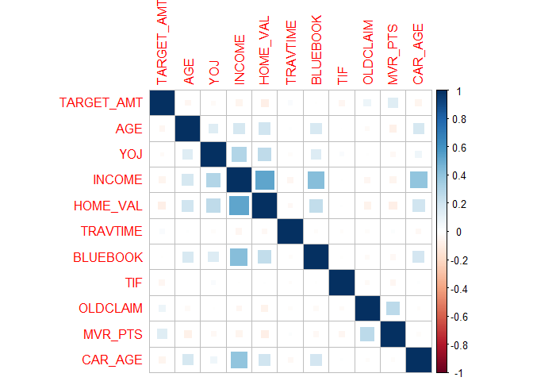<!-- -->

Not a whole lot of correlation between variables, and very little with
the target variables. The only notable exceptions are income with
bluebook, car age, and home value, which are all fairly positively
correlated correlated. We’ll examine variables further while modeling.

## Modeling Crash Probability

Let’s start off with a simple base model (all variables) for predicting
whether or not there was a crash claim. We’ll gauge performances using a
holdout data-set, separated from the training set.

``` r
#Train test split
set.seed(1234567890)
splitdex<- createDataPartition(df$TARGET_FLAG, p = 0.8, list = FALSE)
train <- df[splitdex,]
validation <- df[-splitdex,]


#Make the model
model <- glm(TARGET_FLAG~.-TARGET_AMT, data = train, family = "binomial")

summary(model)
```

    ## 
    ## Call:
    ## glm(formula = TARGET_FLAG ~ . - TARGET_AMT, family = "binomial", 
    ##     data = train)
    ## 
    ## Deviance Residuals: 
    ##     Min       1Q   Median       3Q      Max  
    ## -2.4431  -0.7110  -0.3957   0.6768   3.1419  
    ## 
    ## Coefficients:
    ##                                   Estimate Std. Error z value Pr(>|z|)    
    ## (Intercept)                     -7.285e-01  3.116e-01  -2.338 0.019397 *  
    ## KIDSDRIV1                        4.314e-01  1.278e-01   3.375 0.000738 ***
    ## KIDSDRIV2                        7.165e-01  1.804e-01   3.972 7.11e-05 ***
    ## KIDSDRIV3                        6.141e-01  3.726e-01   1.648 0.099289 .  
    ## KIDSDRIV4                        5.543e-01  1.217e+00   0.455 0.648785    
    ## AGE                              7.816e-04  4.676e-03   0.167 0.867244    
    ## HOMEKIDS1                        3.492e-01  1.335e-01   2.616 0.008906 ** 
    ## HOMEKIDS2                        2.102e-01  1.311e-01   1.603 0.108854    
    ## HOMEKIDS3                        1.978e-01  1.516e-01   1.305 0.192020    
    ## HOMEKIDS4                        2.755e-01  2.384e-01   1.156 0.247804    
    ## HOMEKIDS5                        1.207e+00  7.882e-01   1.532 0.125597    
    ## YOJ                             -1.143e-02  9.708e-03  -1.178 0.238869    
    ## INCOME                          -4.019e-06  1.256e-06  -3.200 0.001372 ** 
    ## PARENT1Yes                       2.938e-01  1.350e-01   2.176 0.029565 *  
    ## HOME_VAL                        -7.481e-07  3.579e-07  -2.090 0.036609 *  
    ## MSTATUSz_No                      6.243e-01  9.529e-02   6.551 5.71e-11 ***
    ## SEXz_F                          -2.039e-01  1.245e-01  -1.638 0.101458    
    ## EDUCATIONBachelors              -3.614e-01  1.296e-01  -2.788 0.005299 ** 
    ## EDUCATIONMasters                -2.313e-01  1.999e-01  -1.157 0.247386    
    ## EDUCATIONPhD                    -2.808e-02  2.387e-01  -0.118 0.906371    
    ## EDUCATIONz_High School           7.497e-04  1.053e-01   0.007 0.994320    
    ## JOBDoctor                       -1.048e+00  3.267e-01  -3.208 0.001335 ** 
    ## JOBHome Maker                   -1.104e-01  1.639e-01  -0.674 0.500417    
    ## JOBLawyer                       -2.063e-01  2.073e-01  -0.995 0.319634    
    ## JOBManager                      -1.028e+00  1.635e-01  -6.287 3.24e-10 ***
    ## JOBProfessional                 -2.255e-01  1.398e-01  -1.613 0.106806    
    ## JOBStudent                      -1.586e-01  1.482e-01  -1.070 0.284404    
    ## JOBUnemployed                   -1.164e+00  6.198e-01  -1.877 0.060464 .  
    ## JOBUnlisted                     -3.938e-01  2.230e-01  -1.766 0.077388 .  
    ## JOBz_Blue Collar                -1.192e-01  1.190e-01  -1.001 0.316792    
    ## TRAVTIME                         1.433e-02  2.099e-03   6.825 8.80e-12 ***
    ## CAR_USEPrivate                  -7.797e-01  1.022e-01  -7.631 2.32e-14 ***
    ## BLUEBOOK                        -1.810e-05  5.902e-06  -3.067 0.002164 ** 
    ## TIF                             -5.345e-02  8.182e-03  -6.533 6.46e-11 ***
    ## CAR_TYPEPanel Truck              4.839e-01  1.821e-01   2.657 0.007879 ** 
    ## CAR_TYPEPickup                   5.385e-01  1.127e-01   4.777 1.78e-06 ***
    ## CAR_TYPESports Car               1.076e+00  1.451e-01   7.419 1.18e-13 ***
    ## CAR_TYPEVan                      6.520e-01  1.424e-01   4.579 4.68e-06 ***
    ## CAR_TYPEz_SUV                    8.075e-01  1.244e-01   6.492 8.48e-11 ***
    ## RED_CARyes                      -1.040e-01  9.670e-02  -1.075 0.282324    
    ## OLDCLAIM                        -2.336e-05  4.766e-06  -4.903 9.46e-07 ***
    ## CLM_FREQ1                        6.106e-01  1.119e-01   5.455 4.90e-08 ***
    ## CLM_FREQ2                        7.046e-01  1.052e-01   6.695 2.16e-11 ***
    ## CLM_FREQ3                        6.385e-01  1.196e-01   5.338 9.38e-08 ***
    ## CLM_FREQ4                        7.665e-01  1.994e-01   3.844 0.000121 ***
    ## CLM_FREQ5                        1.768e+00  6.541e-01   2.703 0.006870 ** 
    ## REVOKEDYes                       9.876e-01  1.045e-01   9.451  < 2e-16 ***
    ## MVR_PTS                          9.985e-02  1.567e-02   6.371 1.87e-10 ***
    ## CAR_AGE                         -8.920e-03  8.463e-03  -1.054 0.291885    
    ## URBANICITYz_Highly Rural/ Rural -2.232e+00  1.213e-01 -18.404  < 2e-16 ***
    ## ---
    ## Signif. codes:  0 '***' 0.001 '**' 0.01 '*' 0.05 '.' 0.1 ' ' 1
    ## 
    ## (Dispersion parameter for binomial family taken to be 1)
    ## 
    ##     Null deviance: 7566.3  on 6528  degrees of freedom
    ## Residual deviance: 5846.3  on 6479  degrees of freedom
    ## AIC: 5946.3
    ## 
    ## Number of Fisher Scoring iterations: 5

This model finds many of the variables significant in predicting
crashes, however there are some that should be removed as they aren’t
predictive. Let’s see how it performs on the validation set.

``` r
make.predictions <- function(model, test, threshold = 0.5) {
  
    
  test_pred_probs = predict(model, test, type = "response")
  
  test$predict_prob = test_pred_probs
  
  #Took most of this next line from: https://www.r-bloggers.com/2020/05/binary-logistic-regression-with-r/
  test$predicted =  as.factor(ifelse(test_pred_probs >= threshold, 1, 0)) 
  
  return(test[,c("predict_prob","predicted")])
  
}
predictions <- make.predictions(model, validation, threshold = 0.50)


confusionMatrix(predictions$predicted, as.factor(validation$TARGET_FLAG), positive = '1')
```

    ## Confusion Matrix and Statistics
    ## 
    ##           Reference
    ## Prediction    0    1
    ##          0 1113  232
    ##          1  104  183
    ##                                           
    ##                Accuracy : 0.7941          
    ##                  95% CI : (0.7737, 0.8135)
    ##     No Information Rate : 0.7457          
    ##     P-Value [Acc > NIR] : 2.553e-06       
    ##                                           
    ##                   Kappa : 0.3957          
    ##                                           
    ##  Mcnemar's Test P-Value : 4.256e-12       
    ##                                           
    ##             Sensitivity : 0.4410          
    ##             Specificity : 0.9145          
    ##          Pos Pred Value : 0.6376          
    ##          Neg Pred Value : 0.8275          
    ##              Prevalence : 0.2543          
    ##          Detection Rate : 0.1121          
    ##    Detection Prevalence : 0.1759          
    ##       Balanced Accuracy : 0.6778          
    ##                                           
    ##        'Positive' Class : 1               
    ## 

``` r
proc = roc(as.factor(validation$TARGET_FLAG), predictions$predict_prob)
```

    ## Setting levels: control = 0, case = 1

    ## Setting direction: controls < cases

``` r
plot(proc)
```

<!-- -->

``` r
print(proc$auc)
```

    ## Area under the curve: 0.8115

This model has a decent accuracy, but that can be misleading. If you
recall, the data-set has about 74% cases of no crash; this only does a
little better than predicting no crash for each instance. The model’s
lower bound of the 95% confidence interval for accuracy is 77.4%, so
this model is significantly better (at alpha = 0.05) than just guessing
no crash.

One issue with this model is that there are a lot of variables that
aren’t very predictive. There are also a few variables that, explored
previously with the correlation plot, have shown to be correlated. Let’s
try a LASSO model. LASSO will rid us of some of the coefficients, deal
with any co-linearity, and hopefully help us put together a better and
simpler model.

``` r
#I'm copying alot of this from a previous work of mine

library(glmnet)  #Was a helpful guide: https://web.stanford.edu/~hastie/glmnet/glmnet_alpha.html
```

    ## Loading required package: Matrix

    ## 
    ## Attaching package: 'Matrix'

    ## The following objects are masked from 'package:tidyr':
    ## 
    ##     expand, pack, unpack

    ## Loaded glmnet 4.1-3

``` r
#There are random elements to this, but I'm not sure where (relaxed fit?)
set.seed(1234567890)


#Data prep.  Needs to be in matrix format
#Took code from here: https://stackoverflow.com/questions/35437411/error-in-predict-glmnet-function-not-yet-implemented-method
train_X <- model.matrix(~.-TARGET_FLAG -TARGET_AMT,data=train)  
train_Y <- train$TARGET_FLAG

val_X = model.matrix(~.-TARGET_FLAG -TARGET_AMT,data=validation)

#Makes a series of crossvalidated glmnet models for 100 lambda values (default)
#lamba values are constants that define coefficient shrinkage.  
LASSO_crash_model <- cv.glmnet(x = train_X,   #Predictor variables
                      y = train_Y,
                      family = "binomial", #Has it use logit
                      nfolds = 20, #k fold cv
                      intercept = TRUE,
                      standardize = TRUE,
                      type.measure = "class",  #uses missclassification error as loss
                      alpha = 1) #Alpha = 1 is lasso.

#Predicts the probability that the target variable is 1
#setting lambda.min uses the lambda value with the minimum mean cv error (picks the best model)
predictions <- predict(LASSO_crash_model, 
                       newx = val_X,
                       type = "response",
                       s=LASSO_crash_model$lambda.min) 

#Print's the coefficients the model uses
print(coef.glmnet(LASSO_crash_model, s = LASSO_crash_model$lambda.min))
```

    ## 51 x 1 sparse Matrix of class "dgCMatrix"
    ##                                            s1
    ## (Intercept)                     -5.250675e-01
    ## (Intercept)                      .           
    ## KIDSDRIV1                        4.004334e-01
    ## KIDSDRIV2                        6.022020e-01
    ## KIDSDRIV3                        3.750049e-01
    ## KIDSDRIV4                        .           
    ## AGE                             -1.970173e-03
    ## HOMEKIDS1                        1.127480e-01
    ## HOMEKIDS2                        8.943491e-03
    ## HOMEKIDS3                        .           
    ## HOMEKIDS4                        .           
    ## HOMEKIDS5                        6.983762e-01
    ## YOJ                             -2.818820e-03
    ## INCOME                          -4.486304e-06
    ## PARENT1Yes                       4.372747e-01
    ## HOME_VAL                        -8.072571e-07
    ## MSTATUSz_No                      4.555423e-01
    ## SEXz_F                           .           
    ## EDUCATIONBachelors              -2.265760e-01
    ## EDUCATIONMasters                -1.409287e-01
    ## EDUCATIONPhD                     .           
    ## EDUCATIONz_High School           4.804993e-02
    ## JOBDoctor                       -5.221588e-01
    ## JOBHome Maker                    .           
    ## JOBLawyer                        .           
    ## JOBManager                      -7.076978e-01
    ## JOBProfessional                 -2.577050e-03
    ## JOBStudent                       .           
    ## JOBUnemployed                   -3.127200e-01
    ## JOBUnlisted                      .           
    ## JOBz_Blue Collar                 .           
    ## TRAVTIME                         1.153808e-02
    ## CAR_USEPrivate                  -7.382597e-01
    ## BLUEBOOK                        -1.502443e-05
    ## TIF                             -4.324628e-02
    ## CAR_TYPEPanel Truck              8.110495e-02
    ## CAR_TYPEPickup                   2.243845e-01
    ## CAR_TYPESports Car               6.476230e-01
    ## CAR_TYPEVan                      2.647144e-01
    ## CAR_TYPEz_SUV                    4.358309e-01
    ## RED_CARyes                       .           
    ## OLDCLAIM                        -8.416885e-06
    ## CLM_FREQ1                        3.508672e-01
    ## CLM_FREQ2                        4.517532e-01
    ## CLM_FREQ3                        3.700698e-01
    ## CLM_FREQ4                        4.119322e-01
    ## CLM_FREQ5                        9.728506e-01
    ## REVOKEDYes                       7.367550e-01
    ## MVR_PTS                          1.034423e-01
    ## CAR_AGE                         -1.337527e-02
    ## URBANICITYz_Highly Rural/ Rural -1.963756e+00

Fewer variables, but still quite a few. The coefficients tend to make
some sense. For instance, one is more likely to crash if they have more
kids driving, have more prior claims, drive more, and have more record
points. One is less likely to crash however if they are older, have more
years at their job, earn more income, have a pricier car, are more
educated, are unemployed (more careful), and use their own car. One
could probably boil down a lot of these variables to a ‘responsibility’
metric; things like age and prior claims could all play into it. Red
cars, on the other hand, don’t make a meaningful difference (lucky us).

Let’s see how the model performs.

``` r
confusionMatrix(as.factor(ifelse(predictions >= 0.5, 1, 0)), as.factor(validation$TARGET_FLAG), positive = '1')
```

    ## Confusion Matrix and Statistics
    ## 
    ##           Reference
    ## Prediction    0    1
    ##          0 1141  258
    ##          1   76  157
    ##                                           
    ##                Accuracy : 0.7953          
    ##                  95% CI : (0.7749, 0.8147)
    ##     No Information Rate : 0.7457          
    ##     P-Value [Acc > NIR] : 1.436e-06       
    ##                                           
    ##                   Kappa : 0.3692          
    ##                                           
    ##  Mcnemar's Test P-Value : < 2.2e-16       
    ##                                           
    ##             Sensitivity : 0.3783          
    ##             Specificity : 0.9376          
    ##          Pos Pred Value : 0.6738          
    ##          Neg Pred Value : 0.8156          
    ##              Prevalence : 0.2543          
    ##          Detection Rate : 0.0962          
    ##    Detection Prevalence : 0.1428          
    ##       Balanced Accuracy : 0.6579          
    ##                                           
    ##        'Positive' Class : 1               
    ## 

``` r
proc = roc(validation$TARGET_FLAG, predictions)
```

    ## Setting levels: control = 0, case = 1

    ## Warning in roc.default(validation$TARGET_FLAG, predictions): Deprecated use a
    ## matrix as predictor. Unexpected results may be produced, please pass a numeric
    ## vector.

    ## Setting direction: controls < cases

``` r
plot(proc)
```

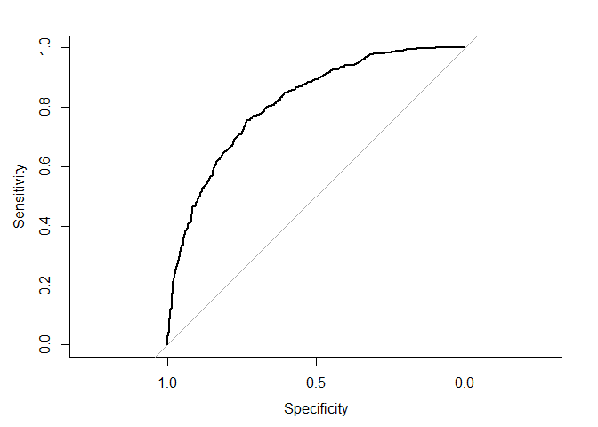<!-- -->

``` r
print(proc$auc)
```

    ## Area under the curve: 0.8133

It’s able to get rid of a few without predictors negatively impacting
the accuracy or AUC much. One other thing to consider is that this model
finds fewer false positives, but more false negatives. That said, it’s
not really any more accurate than the prior model, certainly not
significantly different, and is only about an additional 5% better than
just guessing no crash for all cases.

That being said, it’s a fairly explainable model

## Modeling Payout

Now we need to predict how much those who were predicted to crash
actually get. I suspect the payout is proportional to both the value of
the car and how damaging the crash is. The value of the car is one of
the variables (Bluebook), and I suspect the damage might correlate to
some of the other variables like the type of car and various
‘responsibility’ type measures. We’ll see if any of the models confirm
my suspicions.

There are two different ways to go about selecting the data we want to
use to train this: use data from all cases where there was a crash, or
only use data where we predicted a crash. Using all cases of crashes
might be better at predicting the payout from crashes for the
population, but using only predicted cases might be a more practical
fit. Let’s try it with all cases, using a basic multiple linear
regression model, and LASSO again to try to get the number of predictors
down.

Below is a basic multiple regression model

``` r
#Select only instances where a crash occured
all_crash <- subset(df, TARGET_FLAG == 1)
all_crash$TARGET_FLAG <- NULL

set.seed(0987654321)

#Train test split
splitdex <- createDataPartition(all_crash$TARGET_AMT, p = 0.8, list = FALSE)
crash_train <- all_crash[splitdex,]
crash_validation <- all_crash[-splitdex,]

base_model_payout <- lm(TARGET_AMT~., crash_train)
summary(base_model_payout)
```

    ## 
    ## Call:
    ## lm(formula = TARGET_AMT ~ ., data = crash_train)
    ## 
    ## Residuals:
    ##    Min     1Q Median     3Q    Max 
    ##  -8176  -3148  -1495    433  99049 
    ## 
    ## Coefficients:
    ##                                   Estimate Std. Error t value Pr(>|t|)   
    ## (Intercept)                      4.146e+03  1.725e+03   2.403  0.01636 * 
    ## KIDSDRIV1                       -3.985e+02  6.909e+02  -0.577  0.56422   
    ## KIDSDRIV2                       -2.965e+02  9.223e+02  -0.321  0.74790   
    ## KIDSDRIV3                       -3.186e+02  1.736e+03  -0.184  0.85439   
    ## KIDSDRIV4                       -1.256e+01  8.668e+03  -0.001  0.99884   
    ## AGE                              3.440e+01  2.438e+01   1.411  0.15853   
    ## HOMEKIDS1                        7.239e+02  7.642e+02   0.947  0.34369   
    ## HOMEKIDS2                        1.145e+03  7.457e+02   1.536  0.12469   
    ## HOMEKIDS3                        5.769e+02  8.334e+02   0.692  0.48889   
    ## HOMEKIDS4                        3.760e+02  1.248e+03   0.301  0.76317   
    ## HOMEKIDS5                        9.646e+02  3.924e+03   0.246  0.80586   
    ## YOJ                              3.049e+01  5.627e+01   0.542  0.58803   
    ## INCOME                          -1.177e-02  7.775e-03  -1.514  0.13032   
    ## PARENT1Yes                      -1.203e+02  7.478e+02  -0.161  0.87223   
    ## HOME_VAL                         2.517e-03  2.144e-03   1.174  0.24073   
    ## MSTATUSz_No                      7.875e+02  5.677e+02   1.387  0.16558   
    ## SEXz_F                          -1.199e+03  7.248e+02  -1.654  0.09839 . 
    ## EDUCATIONBachelors               1.866e+01  7.052e+02   0.026  0.97889   
    ## EDUCATIONMasters                 7.616e+02  1.203e+03   0.633  0.52687   
    ## EDUCATIONPhD                     7.218e+02  1.477e+03   0.489  0.62515   
    ## EDUCATIONz_High School          -3.847e+02  5.683e+02  -0.677  0.49855   
    ## JOBDoctor                       -3.661e+02  2.053e+03  -0.178  0.85850   
    ## JOBHome Maker                   -1.157e+02  9.378e+02  -0.123  0.90180   
    ## JOBLawyer                        3.565e+02  1.303e+03   0.274  0.78441   
    ## JOBManager                      -6.846e+02  1.054e+03  -0.650  0.51592   
    ## JOBProfessional                  6.015e+02  8.083e+02   0.744  0.45686   
    ## JOBStudent                      -1.091e+02  8.298e+02  -0.131  0.89543   
    ## JOBUnemployed                    4.695e+03  4.005e+03   1.172  0.24124   
    ## JOBUnlisted                     -2.672e+02  1.363e+03  -0.196  0.84460   
    ## JOBz_Blue Collar                -1.708e+02  6.519e+02  -0.262  0.79332   
    ## TRAVTIME                        -1.348e+01  1.236e+01  -1.090  0.27578   
    ## CAR_USEPrivate                  -9.268e+02  5.826e+02  -1.591  0.11182   
    ## BLUEBOOK                         9.757e-02  3.389e-02   2.879  0.00403 **
    ## TIF                             -3.109e+01  4.756e+01  -0.654  0.51336   
    ## CAR_TYPEPanel Truck             -5.352e+02  1.051e+03  -0.509  0.61061   
    ## CAR_TYPEPickup                  -4.017e+02  6.576e+02  -0.611  0.54137   
    ## CAR_TYPESports Car               3.379e+02  8.260e+02   0.409  0.68253   
    ## CAR_TYPEVan                      1.325e+02  8.632e+02   0.153  0.87807   
    ## CAR_TYPEz_SUV                    7.561e+02  7.376e+02   1.025  0.30547   
    ## RED_CARyes                      -1.970e+02  5.517e+02  -0.357  0.72101   
    ## OLDCLAIM                         2.603e-02  2.779e-02   0.937  0.34904   
    ## CLM_FREQ1                       -4.273e+02  6.205e+02  -0.689  0.49114   
    ## CLM_FREQ2                       -5.675e+02  5.908e+02  -0.961  0.33691   
    ## CLM_FREQ3                        8.426e+01  6.481e+02   0.130  0.89658   
    ## CLM_FREQ4                       -1.269e+03  1.015e+03  -1.250  0.21140   
    ## CLM_FREQ5                       -1.521e+03  3.171e+03  -0.480  0.63155   
    ## REVOKEDYes                      -1.113e+03  6.015e+02  -1.851  0.06435 . 
    ## MVR_PTS                          1.305e+02  7.767e+01   1.680  0.09312 . 
    ## CAR_AGE                         -5.468e+01  4.841e+01  -1.130  0.25885   
    ## URBANICITYz_Highly Rural/ Rural  6.260e+02  8.860e+02   0.707  0.47995   
    ## ---
    ## Signif. codes:  0 '***' 0.001 '**' 0.01 '*' 0.05 '.' 0.1 ' ' 1
    ## 
    ## Residual standard error: 7613 on 1675 degrees of freedom
    ## Multiple R-squared:  0.03043,    Adjusted R-squared:  0.002062 
    ## F-statistic: 1.073 on 49 and 1675 DF,  p-value: 0.3408

``` r
plot(base_model_payout)
```

    ## Warning: not plotting observations with leverage one:
    ##   390

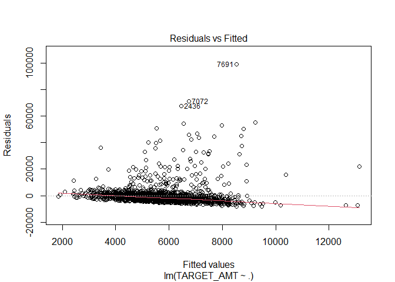<!-- -->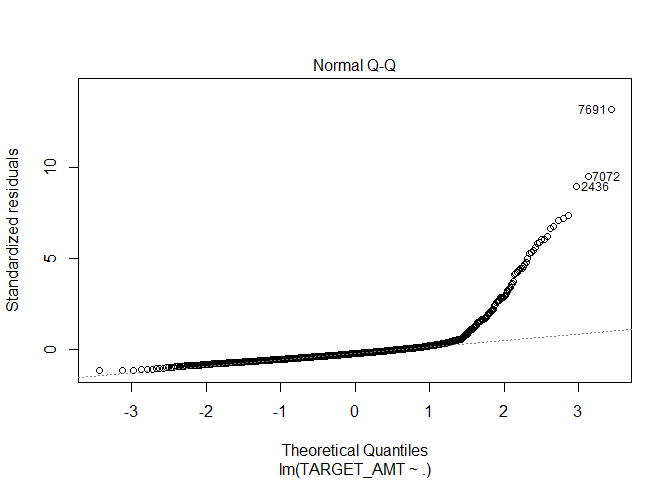<!-- -->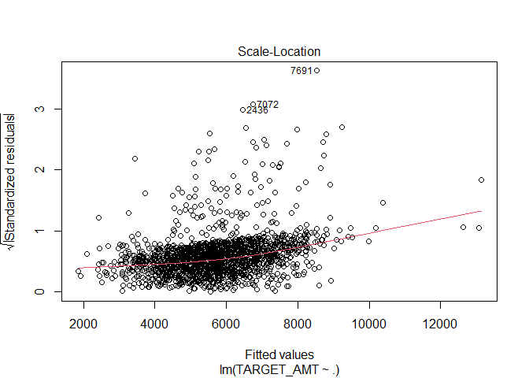<!-- -->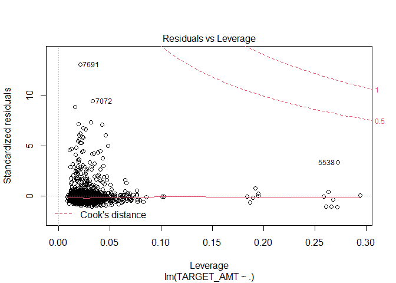<!-- -->

Yeah, pretty bad. This probably does not meet the assumptions of linear
regression either. The only significant predictor here is bluebook,
which I suspected would be one of them (makes sense), but not the only
one. This model does not provide any evidence for my suspicions
regarding the role of ‘damage’ in the payout. One big problem with this
model is the residuals are have a significant right-skew. The response
variable also has a right skew; let’s fix that and see if it helps.
We’ll also only bluebook as the predictor variable.

``` r
#Transforms the response variable first
bluebook_model_payout <- lm(log(crash_train$TARGET_AMT)~BLUEBOOK, crash_train)
summary(bluebook_model_payout)
```

    ## 
    ## Call:
    ## lm(formula = log(crash_train$TARGET_AMT) ~ BLUEBOOK, data = crash_train)
    ## 
    ## Residuals:
    ##     Min      1Q  Median      3Q     Max 
    ## -4.8027 -0.4065  0.0374  0.3890  3.2699 
    ## 
    ## Coefficients:
    ##              Estimate Std. Error t value Pr(>|t|)    
    ## (Intercept) 8.144e+00  3.868e-02 210.535  < 2e-16 ***
    ## BLUEBOOK    9.531e-06  2.341e-06   4.071 4.89e-05 ***
    ## ---
    ## Signif. codes:  0 '***' 0.001 '**' 0.01 '*' 0.05 '.' 0.1 ' ' 1
    ## 
    ## Residual standard error: 0.8064 on 1723 degrees of freedom
    ## Multiple R-squared:  0.009527,   Adjusted R-squared:  0.008953 
    ## F-statistic: 16.57 on 1 and 1723 DF,  p-value: 4.891e-05

``` r
plot(bluebook_model_payout)
```

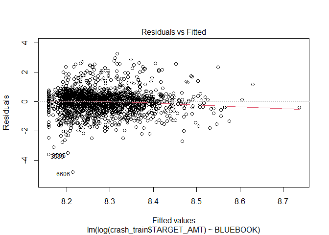<!-- -->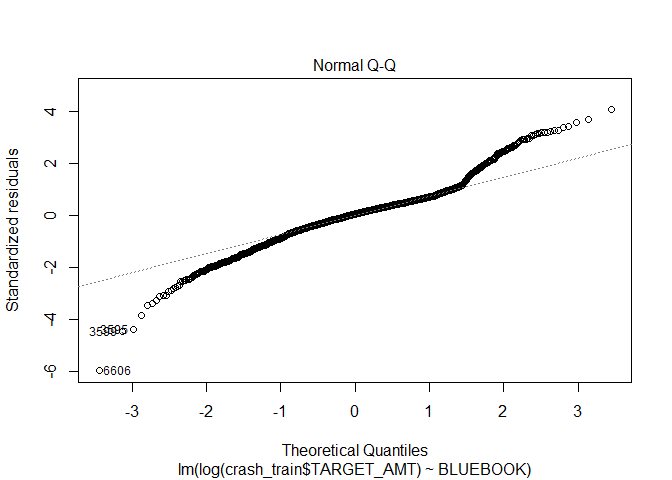<!-- -->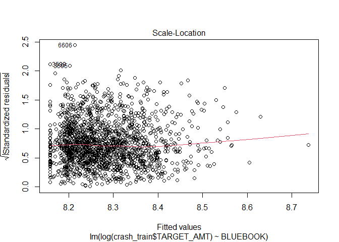<!-- -->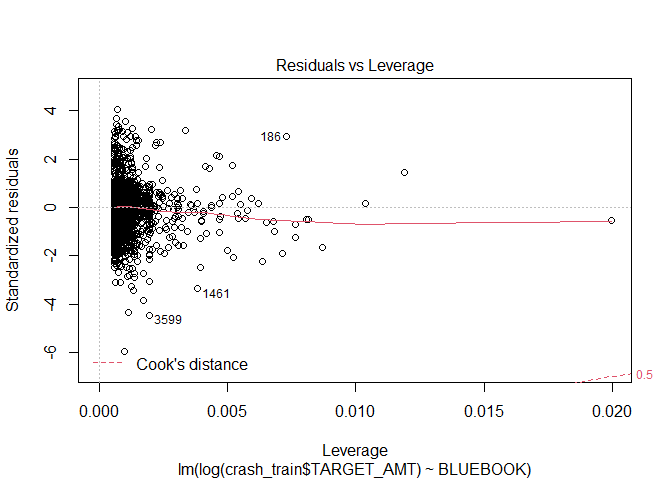<!-- -->

``` r
#Finds how well the predictions match up to the actual validation data
#Also reverses the log transformation after predictions are made
fit <- lm(exp(predict(bluebook_model_payout, crash_validation[,2:24]))~crash_validation$TARGET_AMT)
plot(exp(predict(bluebook_model_payout, crash_validation[,2:24]))~crash_validation$TARGET_AMT)
abline(0,1, col = "red")
```

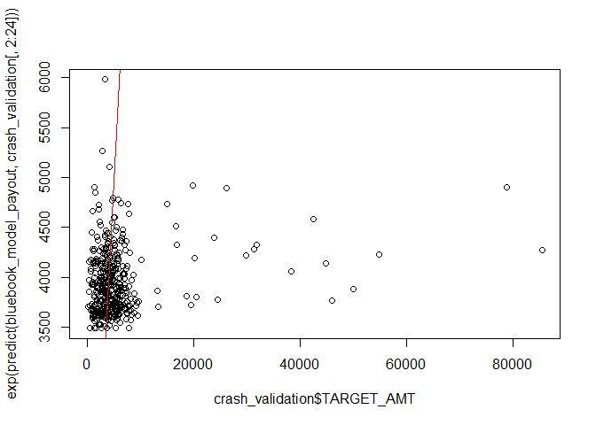<!-- -->

``` r
summary(fit)
```

    ## 
    ## Call:
    ## lm(formula = exp(predict(bluebook_model_payout, crash_validation[, 
    ##     2:24])) ~ crash_validation$TARGET_AMT)
    ## 
    ## Residuals:
    ##    Min     1Q Median     3Q    Max 
    ## -485.2 -250.6  -68.3  172.6 2048.2 
    ## 
    ## Coefficients:
    ##                              Estimate Std. Error t value Pr(>|t|)    
    ## (Intercept)                 3.907e+03  1.896e+01 206.008  < 2e-16 ***
    ## crash_validation$TARGET_AMT 7.550e-03  1.898e-03   3.978 8.17e-05 ***
    ## ---
    ## Signif. codes:  0 '***' 0.001 '**' 0.01 '*' 0.05 '.' 0.1 ' ' 1
    ## 
    ## Residual standard error: 322.7 on 426 degrees of freedom
    ## Multiple R-squared:  0.03582,    Adjusted R-squared:  0.03355 
    ## F-statistic: 15.82 on 1 and 426 DF,  p-value: 8.167e-05

The residuals look much better after a log transformation, but the model
is still only weekly predictive, and cannot predict high payouts
(>$5000) well at all. That Q-Q plot is also pretty suspect. Many
variables such as car age and type will directly play into the bluebook
value, and are implicated in this model as well. Let’s try using LASSO
to reduce the number of coefficients (it seems like only one or a
handful are useful), handle co-linearity, and see if it comes up with a
better model.

``` r
set.seed(0987654321)


#Data prep.  Needs to be in matrix format
#Took code from here: https://stackoverflow.com/questions/35437411/error-in-predict-glmnet-function-not-yet-implemented-method
crash_train_X <- model.matrix(~. -TARGET_AMT,data=crash_train)  

#Needs a log transformation
crash_train_Y <- log(crash_train$TARGET_AMT)

crash_val_X = model.matrix(~. -TARGET_AMT,data=crash_validation)

#Makes a series of crossvalidated glmnet models for 100 lambda values (default)
#lamba values are constants that define coefficient shrinkage.  
LASSO_payout_model <- cv.glmnet(x = crash_train_X,   #Predictor variables
                      y = crash_train_Y,
                      intercept = TRUE,
                      standardize = TRUE,
                      nfolds = 10, #k fold cv
                      type.measure = "mse",  #uses mean squared error as loss
                      alpha = 1) #Alpha = 1 is lasso.

#setting lambda.min uses the lambda value with the minimum mean cv error (picks the best model).  also corrects for the log transformation
predictions <- exp(predict(LASSO_payout_model, newx = crash_val_X, s=LASSO_payout_model$lambda.min)) 

#Print's the coefficients the model uses
print(coef.glmnet(LASSO_payout_model, s = LASSO_payout_model$lambda.min))
```

    ## 51 x 1 sparse Matrix of class "dgCMatrix"
    ##                                            s1
    ## (Intercept)                      8.211314e+00
    ## (Intercept)                      .           
    ## KIDSDRIV1                        .           
    ## KIDSDRIV2                        .           
    ## KIDSDRIV3                        .           
    ## KIDSDRIV4                        .           
    ## AGE                              .           
    ## HOMEKIDS1                        .           
    ## HOMEKIDS2                        .           
    ## HOMEKIDS3                        .           
    ## HOMEKIDS4                        .           
    ## HOMEKIDS5                        .           
    ## YOJ                              .           
    ## INCOME                           .           
    ## PARENT1Yes                       .           
    ## HOME_VAL                         .           
    ## MSTATUSz_No                      .           
    ## SEXz_F                           .           
    ## EDUCATIONBachelors               .           
    ## EDUCATIONMasters                 .           
    ## EDUCATIONPhD                     .           
    ## EDUCATIONz_High School           .           
    ## JOBDoctor                        .           
    ## JOBHome Maker                    .           
    ## JOBLawyer                        .           
    ## JOBManager                       .           
    ## JOBProfessional                  .           
    ## JOBStudent                       .           
    ## JOBUnemployed                    .           
    ## JOBUnlisted                      .           
    ## JOBz_Blue Collar                 .           
    ## TRAVTIME                         .           
    ## CAR_USEPrivate                   .           
    ## BLUEBOOK                         4.975035e-06
    ## TIF                              .           
    ## CAR_TYPEPanel Truck              .           
    ## CAR_TYPEPickup                   .           
    ## CAR_TYPESports Car               .           
    ## CAR_TYPEVan                      .           
    ## CAR_TYPEz_SUV                    .           
    ## RED_CARyes                       .           
    ## OLDCLAIM                         .           
    ## CLM_FREQ1                        .           
    ## CLM_FREQ2                        .           
    ## CLM_FREQ3                        .           
    ## CLM_FREQ4                       -6.530999e-02
    ## CLM_FREQ5                        .           
    ## REVOKEDYes                       .           
    ## MVR_PTS                          .           
    ## CAR_AGE                          .           
    ## URBANICITYz_Highly Rural/ Rural  .

``` r
plot(predictions~crash_validation$TARGET_AMT)
abline(0,1, col = "red")
```

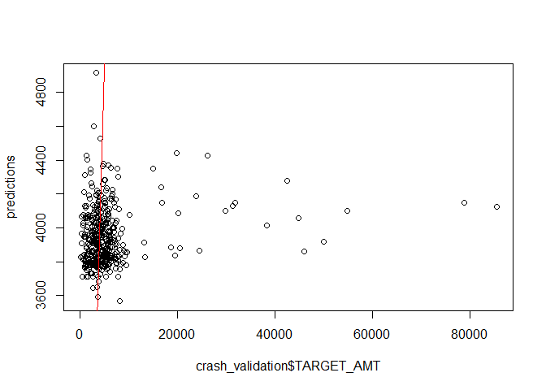<!-- -->

``` r
fit <- lm(predictions~crash_validation$TARGET_AMT)

summary(fit)
```

    ## 
    ## Call:
    ## lm(formula = predictions ~ crash_validation$TARGET_AMT)
    ## 
    ## Residuals:
    ##     Min      1Q  Median      3Q     Max 
    ## -389.60 -127.59  -30.15   93.20  972.98 
    ## 
    ## Coefficients:
    ##                              Estimate Std. Error t value Pr(>|t|)    
    ## (Intercept)                 3.930e+03  9.822e+00 400.105  < 2e-16 ***
    ## crash_validation$TARGET_AMT 3.281e-03  9.831e-04   3.338 0.000918 ***
    ## ---
    ## Signif. codes:  0 '***' 0.001 '**' 0.01 '*' 0.05 '.' 0.1 ' ' 1
    ## 
    ## Residual standard error: 167.1 on 426 degrees of freedom
    ## Multiple R-squared:  0.02549,    Adjusted R-squared:  0.0232 
    ## F-statistic: 11.14 on 1 and 426 DF,  p-value: 0.0009185

This is a very similar model to the Bluebook model. The only other bit
LASSO adds in here is if there have been 4 claims (fairly rare) then you
the payout is less. Also similar to the bluebook model, it doesn’t work
well, especially for predicting high payouts. The Bluebook model does
better when comparing the fit of predicted values vs actual values on
the validation set.

As to the theory that Payout = Car-Value X Damage, we can confirm that
car-value (bluebook) does play a significant role, but are unable to
confirm that the amount of damage done has any affect. This could be
because either damage does not have a role, or the variables we have are
unable to predict the amount of damage done.

## Selecting Models and Making Predictions

We’ll be using the LASSO model to predict whether or not there was a
crash, and the bluebook model to predict how much the payout was. When
evaluated on a holdout set, both classification models are similar
statistics wise (similar accuracy, AUC, etc), but the LASSO model is
simpler. Of the payout prediction models, it appears the variables just
aren’t very predictive of cost, with the exception of Bluebook (car
value), which makes sense. A simple linear regression model with
Bluebook and an intercept only out performed the others in terms of R^2
as evaluated on how well the predictions on a holdout set fit the real
costs. It’s also a super simple model and highly sensible model, which
is nice. The residual plots for the bluebook model were also
permissible, owing in great part to the log transformation of the
response variable.

Below the test set is imported, prepared, and predictions are made. The
predictions then saved locally.

``` r
url <- "https://raw.githubusercontent.com/davidblumenstiel/Portfolio_2022/main/Predicting%20Auto%20Insurance%20Claims/data/insurance-evaluation-data.csv"

test<- fetch_and_prep(url)

#Not sure why, but this needs slighly different prep than the validation set
test_X <- model.matrix(~.,data=test[,3:25]) 

#Predicts probability of crash
predictions <- data.frame(predict(LASSO_crash_model, newx = test_X, type = "response", s=LASSO_crash_model$lambda.min))
colnames(predictions) <- "crash_probability"

#If probability of a crash is >50% then it lists as crash (1), otherwise no crash (0)
predictions <- predictions %>%
  mutate(class = as.factor(round(crash_probability)))

#If there's a crash, then it assigns a predicted cost for the payout, otherwise it sets it to 0

#There are probably better ways to do this than overwriting
predictions["cost"] <- exp(predict(bluebook_model_payout, test))
predictions$cost[predictions$class == 0] <- 0 

#Save predictions locally
write.csv(predictions, file = "predictions.csv")
```
