Predicting Wine Sales
================
David Blumenstiel
5/8/2021

We will be working with data pertaining to wine and how many cases
purchased by wine distributors. The data includes many characteristics
of the wine, including cases sold, pH, the appeal of the label, a taste
rating, and more. The objective is to use the variables to make models
which predict the amount of cases sold.

## Exploratory Data Analysis

First, we load the libraries we’ll be using, along with the data

``` r
library(corrplot)
library(caret)
library(MASS)
library(pscl)
```

``` r
train <- read.csv("https://raw.githubusercontent.com/davidblumenstiel/Portfolio_2022/main/Predicting%20Wine%20Sales/data/wine-training-data.csv")

test <- read.csv("https://raw.githubusercontent.com/davidblumenstiel/Portfolio_2022/main/Predicting%20Wine%20Sales/data/wine-evaluation-data.csv") 
```

Let’s take a quick peek at the data.

``` r
summary(train)
```

    ##     ï..INDEX         TARGET       FixedAcidity     VolatileAcidity  
    ##  Min.   :    1   Min.   :0.000   Min.   :-18.100   Min.   :-2.7900  
    ##  1st Qu.: 4038   1st Qu.:2.000   1st Qu.:  5.200   1st Qu.: 0.1300  
    ##  Median : 8110   Median :3.000   Median :  6.900   Median : 0.2800  
    ##  Mean   : 8070   Mean   :3.029   Mean   :  7.076   Mean   : 0.3241  
    ##  3rd Qu.:12106   3rd Qu.:4.000   3rd Qu.:  9.500   3rd Qu.: 0.6400  
    ##  Max.   :16129   Max.   :8.000   Max.   : 34.400   Max.   : 3.6800  
    ##                                                                     
    ##    CitricAcid      ResidualSugar        Chlorides       FreeSulfurDioxide
    ##  Min.   :-3.2400   Min.   :-127.800   Min.   :-1.1710   Min.   :-555.00  
    ##  1st Qu.: 0.0300   1st Qu.:  -2.000   1st Qu.:-0.0310   1st Qu.:   0.00  
    ##  Median : 0.3100   Median :   3.900   Median : 0.0460   Median :  30.00  
    ##  Mean   : 0.3084   Mean   :   5.419   Mean   : 0.0548   Mean   :  30.85  
    ##  3rd Qu.: 0.5800   3rd Qu.:  15.900   3rd Qu.: 0.1530   3rd Qu.:  70.00  
    ##  Max.   : 3.8600   Max.   : 141.150   Max.   : 1.3510   Max.   : 623.00  
    ##                    NA's   :616        NA's   :638       NA's   :647      
    ##  TotalSulfurDioxide    Density             pH          Sulphates      
    ##  Min.   :-823.0     Min.   :0.8881   Min.   :0.480   Min.   :-3.1300  
    ##  1st Qu.:  27.0     1st Qu.:0.9877   1st Qu.:2.960   1st Qu.: 0.2800  
    ##  Median : 123.0     Median :0.9945   Median :3.200   Median : 0.5000  
    ##  Mean   : 120.7     Mean   :0.9942   Mean   :3.208   Mean   : 0.5271  
    ##  3rd Qu.: 208.0     3rd Qu.:1.0005   3rd Qu.:3.470   3rd Qu.: 0.8600  
    ##  Max.   :1057.0     Max.   :1.0992   Max.   :6.130   Max.   : 4.2400  
    ##  NA's   :682                         NA's   :395     NA's   :1210     
    ##     Alcohol       LabelAppeal          AcidIndex          STARS      
    ##  Min.   :-4.70   Min.   :-2.000000   Min.   : 4.000   Min.   :1.000  
    ##  1st Qu.: 9.00   1st Qu.:-1.000000   1st Qu.: 7.000   1st Qu.:1.000  
    ##  Median :10.40   Median : 0.000000   Median : 8.000   Median :2.000  
    ##  Mean   :10.49   Mean   :-0.009066   Mean   : 7.773   Mean   :2.042  
    ##  3rd Qu.:12.40   3rd Qu.: 1.000000   3rd Qu.: 8.000   3rd Qu.:3.000  
    ##  Max.   :26.50   Max.   : 2.000000   Max.   :17.000   Max.   :4.000  
    ##  NA's   :653                                          NA's   :3359

Some initial observations about the data:

Many of the measurements contain observations with negative values. This
could indicate that either someone really screwed up their instrument
calibration (unlikely), or that some of these measurements are on some
strange scale (not traditional concentration measurements).

There are also some missing values, which may or may not be predictive
themselves.

Some of these wines are reported to be extremely acidic, with a decent
chunk of them having a pH of 2 or less, which is similar to straight
lemon juice. In addition, some of the pH values are under 0.5, which
would be fairly hazardous (i.e. would be equivalent to drinking the acid
from a car battery); this brings some of these measurements into
question.

There are several things that could be done to improve the data, but
let’s first look a bit more at the distribution of and relationships
between the variables, starting with some histograms.

``` r
par(mfrow = c(2,2))
hist(train$TARGET, breaks = 8)
hist(as.numeric(train$LabelAppeal))
hist(as.numeric(train$STARS))
hist(train$AcidIndex, breaks = 20)
```

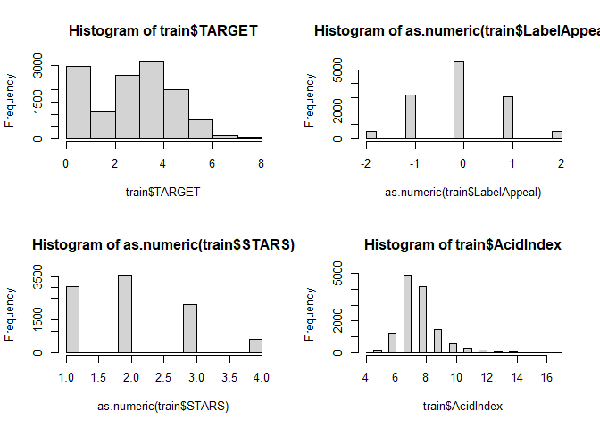<!-- -->

One thing of note is an overabundance of zeros in the TARGET variable
(cases sold), which will likely affect the types of models we’ll want
later on. The distributions of the other variables indicate that some
values are more common than others. STARS and LabelAppeal can likely be
dealt with as categorical data, while AcidIndex may be count data;
AcidIndex seems almost right skewed, but mostly normal (for count data).

For count regression it can be helpful to know how the variance of the
response variable compares to the mean. Below, we can see that the
variance is somehwat higher than the mean, which means regular Poisson
regression might not work as well as somthing that can deal with
overdispersion; somthing to keep in mind.

``` r
print(paste("variance: ", var(train$TARGET), "        mean: ", mean(train$TARGET)))
```

    ## [1] "variance:  3.71089452283923         mean:  3.02907385697538"

Let’s examine also the relationships between the variables.

``` r
#Remove the index variable
train$`ï..INDEX` <- NULL
test$IN <- NULL

corr <- cor(train, method = "pearson", use = "complete.obs")
corrplot(corr, method = "square")
```

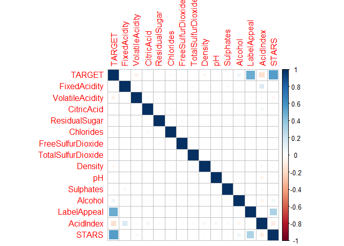<!-- -->

On the face, there’s very little correlation between most variables. Our
most significant correlations are between LabelAppeal, STARS, and
TARGET. LabelAppeal and STARS are somewhat correlated to each-other, but
more so to TARGET; these are likely going to be the two most important
independent variables in the models. To a lesser extent, AcidIndex is
somewhat negatively correlated to TARGET, and might also play a role.
Also interesting is that AcidIndex has little to do with pH or
FixedAcidity; not going to pretend to understand that one.

Let’s further examine the variables, with particular attention paid to
LabelAppeal, STARS, AcidIndex, and the dependent variable, TARGET.

One thing that immediately stands out from these histograms is that all
of these are discrete data. LabelAppeal almost looks like it would
follow a normal distribution were it continuous data, while STARS and
AcidIndex both seems somewhat right skewed in that regard. The TARGET
variable looks like it may be somewhat zero inflated. LabelAppeal and
STARS are both limited, and would probably be be well represented as
categorical data. TARGET is technically unbound, and therefore count
data. I don’t know if AcidIndex has any bounds, but I suspect treating
it as count data would be appropriate.

We also have missing values to consider.

``` r
lapply(train[,c("TARGET","STARS","LabelAppeal","AcidIndex")], function(x) sum(is.na(x)))
```

    ## $TARGET
    ## [1] 0
    ## 
    ## $STARS
    ## [1] 3359
    ## 
    ## $LabelAppeal
    ## [1] 0
    ## 
    ## $AcidIndex
    ## [1] 0

About a quarter of the values in STARS are missing. After some
examination, I suspect missing data here tends to mean fewer cases sold.
Treating STARS as categorical would make it easier to assign the missing
data to a category of it’s own. It’s also plausible that a high STARS
value might mean more expensive wine, and therefore sell less, which is
another argument for considering STARS as categorical rather than count.
We’ll assign missing STARS values to “<NA>”; a category of their own.

## Data Preparation

Not too much data preparation required here. We do need to transform
STARS and LabelAppeal to categorical data, and add an extra category for
missing values in STARS. We’ll also split off a validation set to better
judge the models.

``` r
set.seed(1234567890)

train$STARS <- addNA(train$STARS)  #Changes STARS to factor and adds <NA> as a class
train$LabelAppeal <- as.factor(train$LabelAppeal) #Change to factor class

#Same for test set
test$STARS <- addNA(test$STARS)  #Changes STARS to factor and adds <NA> as a class
test$LabelAppeal <- as.factor(test$LabelAppeal) #Change to factor class


#split off a valiation set
splitdex <- createDataPartition(train$TARGET, p=0.8, list = FALSE)
validation <- train[-splitdex,]
train <- train[splitdex,]

validation_X <- validation[,-1]
validation_Y <- validation[,1]
```

## Modeling

### Poisson Regression

A standard for count regression, the Poisson model could work for this,
but as we discovered earlier, the target variable is somewhat
overdispersed. Below is a basic Poisson model utilizing the variables
discussed previously.

``` r
poisson_model <- glm(TARGET ~ STARS + LabelAppeal + AcidIndex, 
                     data = train,family = "poisson")
                     
summary(poisson_model)
```

    ## 
    ## Call:
    ## glm(formula = TARGET ~ STARS + LabelAppeal + AcidIndex, family = "poisson", 
    ##     data = train)
    ## 
    ## Deviance Residuals: 
    ##     Min       1Q   Median       3Q      Max  
    ## -3.2216  -0.6515   0.0037   0.4612   3.8543  
    ## 
    ## Coefficients:
    ##                Estimate Std. Error z value Pr(>|z|)    
    ## (Intercept)    1.181394   0.055890  21.138  < 2e-16 ***
    ## STARS2         0.321248   0.016099  19.954  < 2e-16 ***
    ## STARS3         0.445030   0.017456  25.495  < 2e-16 ***
    ## STARS4         0.562411   0.024358  23.090  < 2e-16 ***
    ## STARSNA       -0.786963   0.021966 -35.826  < 2e-16 ***
    ## LabelAppeal-1  0.250866   0.042627   5.885 3.98e-09 ***
    ## LabelAppeal0   0.437058   0.041569  10.514  < 2e-16 ***
    ## LabelAppeal1   0.563911   0.042286  13.336  < 2e-16 ***
    ## LabelAppeal2   0.699222   0.047670  14.668  < 2e-16 ***
    ## AcidIndex     -0.079323   0.004987 -15.904  < 2e-16 ***
    ## ---
    ## Signif. codes:  0 '***' 0.001 '**' 0.01 '*' 0.05 '.' 0.1 ' ' 1
    ## 
    ## (Dispersion parameter for poisson family taken to be 1)
    ## 
    ##     Null deviance: 18363  on 10237  degrees of freedom
    ## Residual deviance: 10970  on 10228  degrees of freedom
    ## AIC: 36495
    ## 
    ## Number of Fisher Scoring iterations: 6

``` r
poisson_model_predictions <- predict(poisson_model, validation_X, type = "response")

plot(poisson_model_predictions~validation_Y)
```

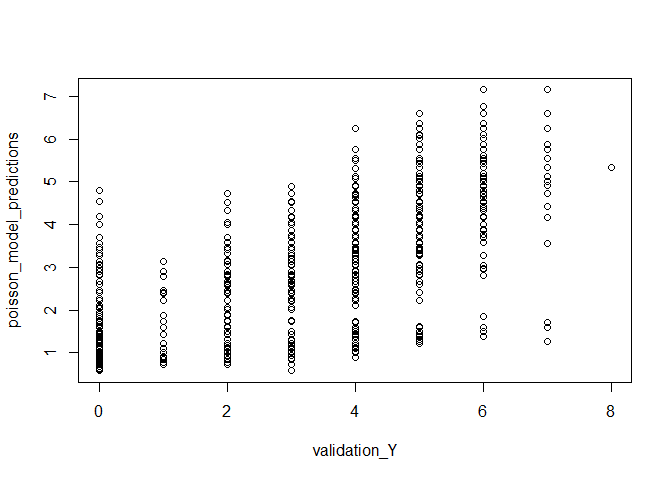<!-- -->

``` r
qqnorm(residuals(poisson_model), )
qqline(residuals(poisson_model))
```

<!-- -->

``` r
hist(residuals(poisson_model), breaks = 20)
```

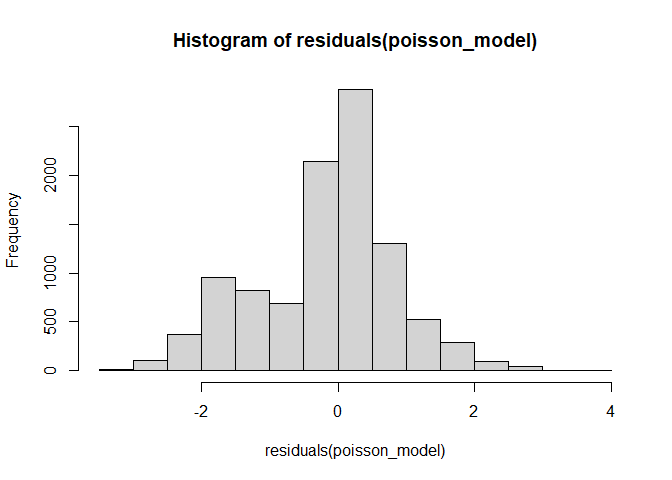<!-- -->

``` r
hist(round(poisson_model_predictions), breaks = 20)
```

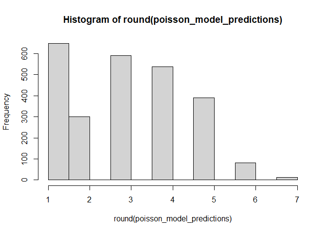<!-- -->

The model ranks all independent variables used as highly significant.
Residuals look fairly normal, although there is definitely a little
deviance from normality when looking the qq-plot of the residuals. The
distribution of the predictions lines up with the distributions of the
TARGET variable + 1, which is strange. This model actually predicts no
zeros at all, despite zero being a common value in the data. I wonder if
subtracting 1 from the predictions would make this more accurate.

### Quasi-Poisson

Theoretically, a Quasi-Poisson model might do better for this data
because of the overdisperson; let’s try one out.

``` r
quasipoisson_model <- glm(TARGET ~ STARS + LabelAppeal + AcidIndex, 
                          data = train,family = quasipoisson)

summary(quasipoisson_model)
```

    ## 
    ## Call:
    ## glm(formula = TARGET ~ STARS + LabelAppeal + AcidIndex, family = quasipoisson, 
    ##     data = train)
    ## 
    ## Deviance Residuals: 
    ##     Min       1Q   Median       3Q      Max  
    ## -3.2216  -0.6515   0.0037   0.4612   3.8543  
    ## 
    ## Coefficients:
    ##                Estimate Std. Error t value Pr(>|t|)    
    ## (Intercept)    1.181394   0.052823  22.365  < 2e-16 ***
    ## STARS2         0.321248   0.015216  21.113  < 2e-16 ***
    ## STARS3         0.445030   0.016498  26.975  < 2e-16 ***
    ## STARS4         0.562411   0.023021  24.431  < 2e-16 ***
    ## STARSNA       -0.786963   0.020760 -37.907  < 2e-16 ***
    ## LabelAppeal-1  0.250866   0.040288   6.227 4.94e-10 ***
    ## LabelAppeal0   0.437058   0.039287  11.125  < 2e-16 ***
    ## LabelAppeal1   0.563911   0.039965  14.110  < 2e-16 ***
    ## LabelAppeal2   0.699222   0.045054  15.520  < 2e-16 ***
    ## AcidIndex     -0.079323   0.004714 -16.828  < 2e-16 ***
    ## ---
    ## Signif. codes:  0 '***' 0.001 '**' 0.01 '*' 0.05 '.' 0.1 ' ' 1
    ## 
    ## (Dispersion parameter for quasipoisson family taken to be 0.8932371)
    ## 
    ##     Null deviance: 18363  on 10237  degrees of freedom
    ## Residual deviance: 10970  on 10228  degrees of freedom
    ## AIC: NA
    ## 
    ## Number of Fisher Scoring iterations: 6

``` r
quasipoisson_model_predictions <- predict(quasipoisson_model, validation_X, type = "response")

plot(poisson_model_predictions~validation_Y)
```

<!-- -->

``` r
qqnorm(residuals(quasipoisson_model), )
qqline(residuals(quasipoisson_model))
```

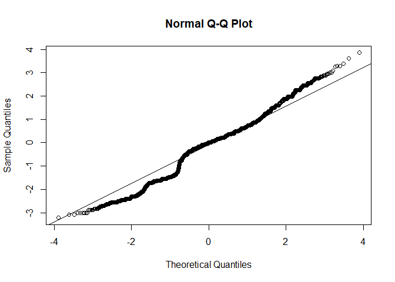<!-- -->

``` r
hist(residuals(quasipoisson_model), breaks = 20)
```

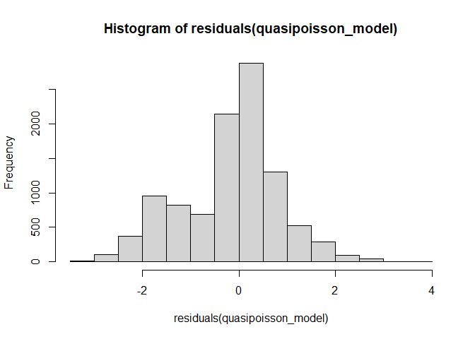<!-- -->

``` r
hist(round(quasipoisson_model_predictions), breaks = 20)
```

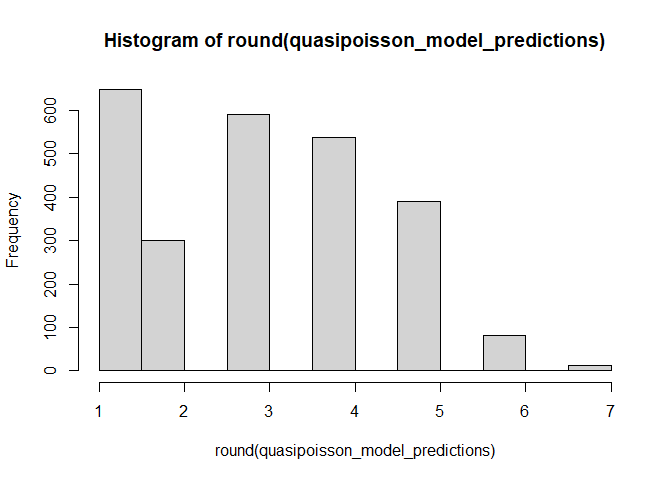<!-- -->

Very little difference compare to the regular Poisson model.

### Negative Binomial

Ordinarily, I’d say negative binomial might be one of the better choices
for modeling a dataset like this given the overdispersion. However, I’m
pretty sure this is not working correctly.

``` r
#Throws an error I couldnt get around
#negative_binomial_model <- glm.nb(TARGET ~ STARS + LabelAppeal + AcidIndex, data = train,
#                                  control = glm.control(maxit = 5000, trace = TRUE),
#                                  link = log)

negative_binomial_model <- glm.nb(TARGET ~ STARS + LabelAppeal + AcidIndex, 
                                  data = train)
```

    ## Warning in theta.ml(Y, mu, sum(w), w, limit = control$maxit, trace =
    ## control$trace > : iteration limit reached

    ## Warning in theta.ml(Y, mu, sum(w), w, limit = control$maxit, trace =
    ## control$trace > : iteration limit reached

``` r
summary(negative_binomial_model)
```

    ## 
    ## Call:
    ## glm.nb(formula = TARGET ~ STARS + LabelAppeal + AcidIndex, data = train, 
    ##     init.theta = 39804.01622, link = log)
    ## 
    ## Deviance Residuals: 
    ##     Min       1Q   Median       3Q      Max  
    ## -3.2215  -0.6514   0.0037   0.4612   3.8541  
    ## 
    ## Coefficients:
    ##                Estimate Std. Error z value Pr(>|z|)    
    ## (Intercept)    1.181415   0.055892  21.137  < 2e-16 ***
    ## STARS2         0.321248   0.016100  19.953  < 2e-16 ***
    ## STARS3         0.445031   0.017457  25.494  < 2e-16 ***
    ## STARS4         0.562412   0.024359  23.089  < 2e-16 ***
    ## STARSNA       -0.786962   0.021967 -35.825  < 2e-16 ***
    ## LabelAppeal-1  0.250866   0.042628   5.885 3.98e-09 ***
    ## LabelAppeal0   0.437056   0.041570  10.514  < 2e-16 ***
    ## LabelAppeal1   0.563908   0.042287  13.335  < 2e-16 ***
    ## LabelAppeal2   0.699217   0.047672  14.667  < 2e-16 ***
    ## AcidIndex     -0.079325   0.004988 -15.904  < 2e-16 ***
    ## ---
    ## Signif. codes:  0 '***' 0.001 '**' 0.01 '*' 0.05 '.' 0.1 ' ' 1
    ## 
    ## (Dispersion parameter for Negative Binomial(39804.02) family taken to be 1)
    ## 
    ##     Null deviance: 18362  on 10237  degrees of freedom
    ## Residual deviance: 10969  on 10228  degrees of freedom
    ## AIC: 36497
    ## 
    ## Number of Fisher Scoring iterations: 1
    ## 
    ## 
    ##               Theta:  39804 
    ##           Std. Err.:  36990 
    ## Warning while fitting theta: iteration limit reached 
    ## 
    ##  2 x log-likelihood:  -36475.09

``` r
negative_binomial_model_predictions <- predict(negative_binomial_model, 
                                               validation_X, type = "response")

plot(negative_binomial_model_predictions~validation_Y)
```

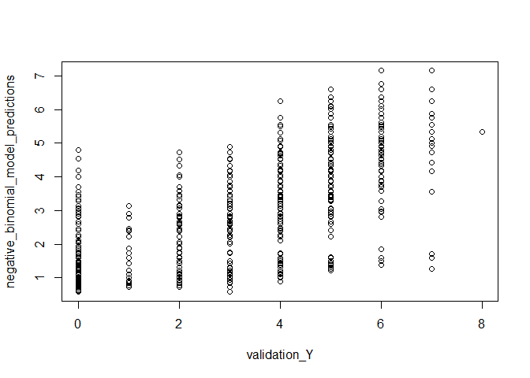<!-- -->

``` r
qqnorm(residuals(negative_binomial_model), )
qqline(residuals(negative_binomial_model))
```

<!-- -->

``` r
hist(residuals(negative_binomial_model), breaks = 20)
```

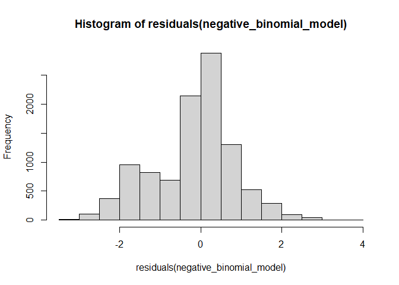<!-- -->

``` r
hist(round(negative_binomial_model_predictions), breaks = 20)
```

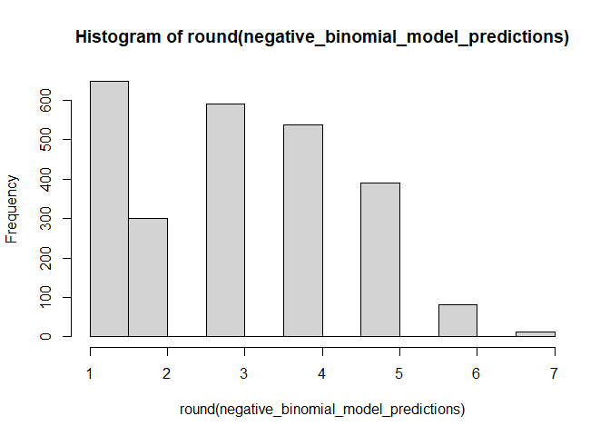<!-- -->

Looks the same as the regular Poisson model. I’m fairly sure this is not
working correctly. I was able to get past an “iteration limit reached”
error by setting a higher limit, but the model broke after that, and I’m
not sure why (after much researching).

### Zero Inflated Poisson Model

Zero inflated Poisson regression is basically a combination of Poisson
regression and logistic model, where the logistic part tries to
determine if the count is 0 or not. Should do well considering the
amount of zeros in the data.

``` r
zi_poisson_model <- zeroinfl(TARGET ~ STARS + LabelAppeal + AcidIndex, 
                             data = train, dist = "poisson")

summary(zi_poisson_model)
```

    ## 
    ## Call:
    ## zeroinfl(formula = TARGET ~ STARS + LabelAppeal + AcidIndex, data = train, 
    ##     dist = "poisson")
    ## 
    ## Pearson residuals:
    ##      Min       1Q   Median       3Q      Max 
    ## -2.26805 -0.44742  0.01228  0.38470  5.58502 
    ## 
    ## Count model coefficients (poisson with log link):
    ##                Estimate Std. Error z value Pr(>|z|)    
    ## (Intercept)    0.640119   0.060314  10.613  < 2e-16 ***
    ## STARS2         0.114838   0.016828   6.824 8.84e-12 ***
    ## STARS3         0.217836   0.018116  12.025  < 2e-16 ***
    ## STARS4         0.316273   0.024902  12.700  < 2e-16 ***
    ## STARSNA       -0.066195   0.023783  -2.783  0.00538 ** 
    ## LabelAppeal-1  0.461105   0.046323   9.954  < 2e-16 ***
    ## LabelAppeal0   0.755852   0.045270  16.697  < 2e-16 ***
    ## LabelAppeal1   0.938932   0.046035  20.396  < 2e-16 ***
    ## LabelAppeal2   1.103963   0.051178  21.571  < 2e-16 ***
    ## AcidIndex     -0.021457   0.005353  -4.009 6.11e-05 ***
    ## 
    ## Zero-inflation model coefficients (binomial with logit link):
    ##                Estimate Std. Error z value Pr(>|z|)    
    ## (Intercept)    -7.21294    0.45040 -16.015  < 2e-16 ***
    ## STARS2         -3.85423    0.40072  -9.618  < 2e-16 ***
    ## STARS3        -18.44881  433.57854  -0.043    0.966    
    ## STARS4        -18.59775  823.35106  -0.023    0.982    
    ## STARSNA         2.08706    0.08406  24.829  < 2e-16 ***
    ## LabelAppeal-1   1.51377    0.38057   3.978 6.96e-05 ***
    ## LabelAppeal0    2.33517    0.37728   6.190 6.04e-10 ***
    ## LabelAppeal1    3.05462    0.38309   7.974 1.54e-15 ***
    ## LabelAppeal2    3.67788    0.44289   8.304  < 2e-16 ***
    ## AcidIndex       0.41472    0.02817  14.722  < 2e-16 ***
    ## ---
    ## Signif. codes:  0 '***' 0.001 '**' 0.01 '*' 0.05 '.' 0.1 ' ' 1 
    ## 
    ## Number of iterations in BFGS optimization: 26 
    ## Log-likelihood: -1.628e+04 on 20 Df

``` r
zi_poisson_model_predictions <- predict(zi_poisson_model, 
                                        validation_X, type = "response")

plot(zi_poisson_model_predictions~validation_Y)
```

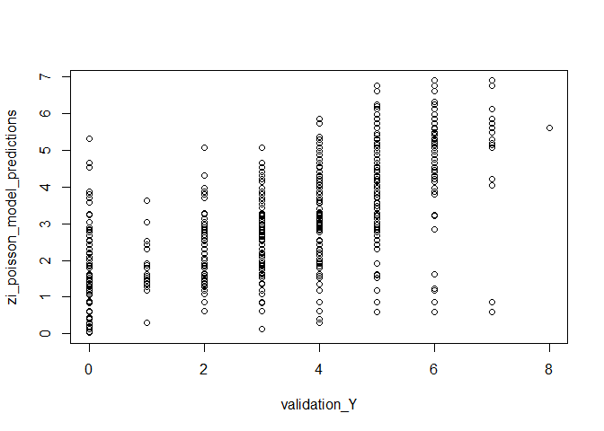<!-- -->

``` r
qqnorm(residuals(zi_poisson_model), )
qqline(residuals(zi_poisson_model))
```

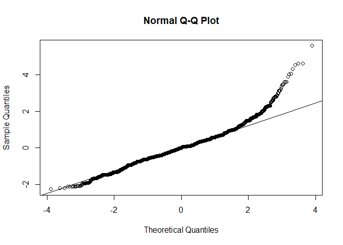<!-- -->

``` r
hist(residuals(zi_poisson_model), breaks = 20)
```

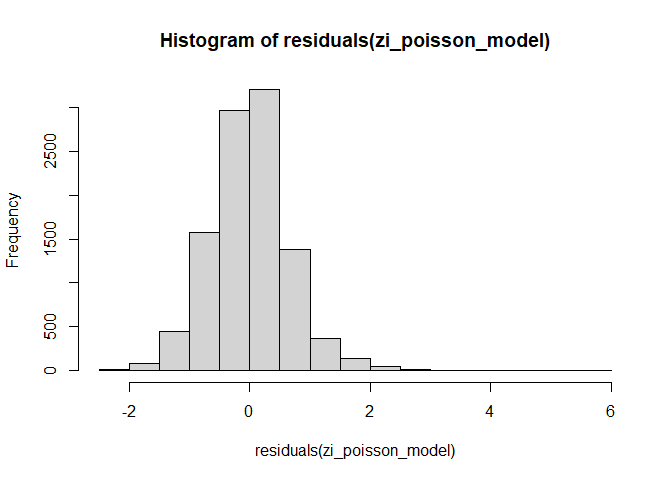<!-- -->

``` r
hist(round(zi_poisson_model_predictions), breaks = 20)
```

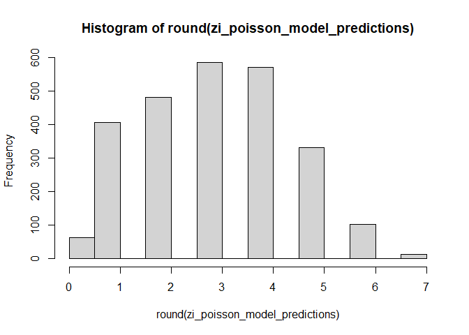<!-- -->

Residuals here are pretty normally distributed, albeit with a heavy
right tail as evidenced by the qq-plot. This model predicts zeros, but
still not nearly as much as occur within the data. Better than none
though

### Hurdle Poisson model

Nothing is predicting zero much, and negative binomials are breaking.
Let’s try a hurdle model and see if it works well.

``` r
hurdle_model <- hurdle(TARGET ~ STARS + LabelAppeal + AcidIndex, 
                       data = train, dist = "poisson", zero.dist = "binomial")

summary(hurdle_model)
```

    ## 
    ## Call:
    ## hurdle(formula = TARGET ~ STARS + LabelAppeal + AcidIndex, data = train, 
    ##     dist = "poisson", zero.dist = "binomial")
    ## 
    ## Pearson residuals:
    ##       Min        1Q    Median        3Q       Max 
    ## -2.084704 -0.451065 -0.002507  0.394872  4.746781 
    ## 
    ## Count model coefficients (truncated poisson with log link):
    ##                Estimate Std. Error z value Pr(>|z|)    
    ## (Intercept)    0.499286   0.068964   7.240 4.49e-13 ***
    ## STARS2         0.108719   0.017299   6.285 3.29e-10 ***
    ## STARS3         0.204720   0.018564  11.028  < 2e-16 ***
    ## STARS4         0.308334   0.025317  12.179  < 2e-16 ***
    ## STARSNA       -0.053993   0.024085  -2.242  0.02497 *  
    ## LabelAppeal-1  0.562944   0.056281  10.002  < 2e-16 ***
    ## LabelAppeal0   0.869912   0.055249  15.745  < 2e-16 ***
    ## LabelAppeal1   1.061364   0.055889  18.991  < 2e-16 ***
    ## LabelAppeal2   1.229284   0.060198  20.421  < 2e-16 ***
    ## AcidIndex     -0.018356   0.005463  -3.360  0.00078 ***
    ## Zero hurdle model coefficients (binomial with logit link):
    ##                Estimate Std. Error z value Pr(>|z|)    
    ## (Intercept)     5.23274    0.23914  21.881  < 2e-16 ***
    ## STARS2          2.47354    0.13380  18.487  < 2e-16 ***
    ## STARS3         18.44875  407.35935   0.045  0.96388    
    ## STARS4         18.59773  785.22997   0.024  0.98110    
    ## STARSNA        -1.83134    0.06799 -26.937  < 2e-16 ***
    ## LabelAppeal-1  -0.43780    0.14987  -2.921  0.00349 ** 
    ## LabelAppeal0   -0.89250    0.14592  -6.116 9.58e-10 ***
    ## LabelAppeal1   -1.45424    0.15707  -9.258  < 2e-16 ***
    ## LabelAppeal2   -1.96634    0.24816  -7.924 2.30e-15 ***
    ## AcidIndex      -0.37911    0.02345 -16.166  < 2e-16 ***
    ## ---
    ## Signif. codes:  0 '***' 0.001 '**' 0.01 '*' 0.05 '.' 0.1 ' ' 1 
    ## 
    ## Number of iterations in BFGS optimization: 16 
    ## Log-likelihood: -1.625e+04 on 20 Df

``` r
hurdle_model_predictions <- predict(hurdle_model, validation_X, type = "response")

plot(hurdle_model_predictions ~ validation_Y)
```

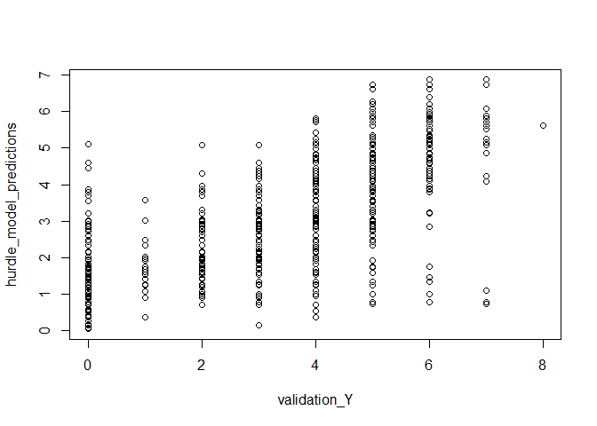<!-- -->

``` r
qqnorm(residuals(hurdle_model), )
qqline(residuals(hurdle_model))
```

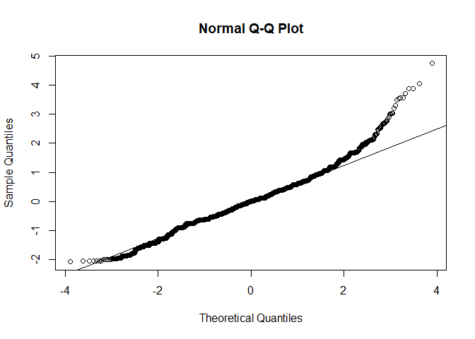<!-- -->

``` r
hist(residuals(hurdle_model), breaks = 20)
```

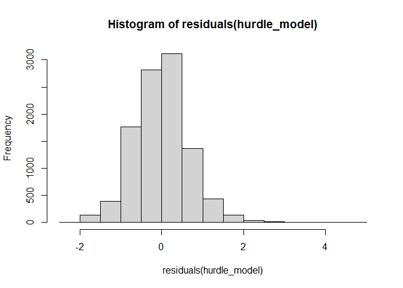<!-- -->

``` r
hist(round(hurdle_model_predictions), breaks = 20)
```

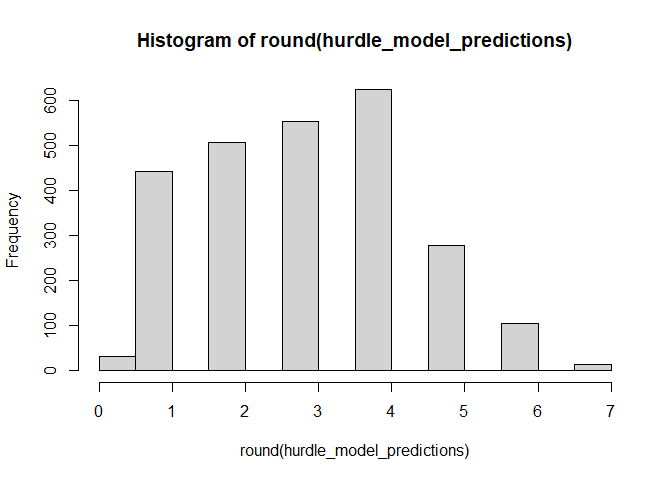<!-- -->

Very similar outcome to the zero inflated Poisson model. Heavy right
tail on the the qq-plot, predicts zeros but still not as much as occur
within the data.

## Model Selection

Because we used a holdout set, we can compare model performance on the
validation set. To do this, we’ll use RMSE, AIC, BIC, and the sum of the
absolute differences between predicted sales and actual sales.

``` r
Models = c("Poisson", "Quasi-Poisson","Negative Binomial", "Zero Inflated Poisson", "Hurdle")

RMSE = c(RMSE(poisson_model_predictions, validation_Y),
         RMSE(quasipoisson_model_predictions, validation_Y),
         RMSE(negative_binomial_model_predictions, validation_Y),
         RMSE(zi_poisson_model_predictions, validation_Y),
         RMSE(hurdle_model_predictions, validation_Y))

.AIC = c(poisson_model$aic,
        quasipoisson_model$aic,
        negative_binomial_model$aic,
        AIC(zi_poisson_model),
        AIC(hurdle_model))

BIC = c(BIC(poisson_model),
        BIC(quasipoisson_model),
        BIC(negative_binomial_model),
        BIC(zi_poisson_model),
        BIC(hurdle_model))

Sum_Absolute_Prediction_Diffential = c(sum(abs(poisson_model_predictions - validation_Y)),
                              sum(abs(quasipoisson_model_predictions - validation_Y)),
                              sum(abs(negative_binomial_model_predictions - validation_Y)),
                              sum(abs(zi_poisson_model_predictions - validation_Y)),
                              sum(abs(hurdle_model_predictions - validation_Y)))


data.frame(Models, RMSE, .AIC, BIC, Sum_Absolute_Prediction_Diffential)
```

    ##                  Models     RMSE     .AIC      BIC
    ## 1               Poisson 1.316171 36494.75 36567.09
    ## 2         Quasi-Poisson 1.316171       NA       NA
    ## 3     Negative Binomial 1.316172 36497.09 36576.67
    ## 4 Zero Inflated Poisson 1.295443 32598.80 32743.48
    ## 5                Hurdle 1.289891 32546.51 32691.19
    ##   Sum_Absolute_Prediction_Diffential
    ## 1                           2643.668
    ## 2                           2643.668
    ## 3                           2643.670
    ## 4                           2511.851
    ## 5                           2518.164

One important thing of note here is that all results are very similar,
especially AIC. The best model here is likely the hurdle Poisson model,
with has the lowest RMSE, BIC, and the second closest actual predictions
as measured. The zero inflated Poisson model and hurdle model are both
predict zeros, which may have something to do with their better
performance. When we look at the sum of the absolute errors between
predicted and actual sales in cases
(Sum_Absolute_Prediction_Differential), we see that the hurdle Poisson
and zero inflated Poisson models predict are about 130 cases closer than
the others, which means those models are more practical.

As for choosing a model, it’s something of a tossup between the hurdle
Poisson and zero inflated Poisson models. We’ll go with the hurdle
Poisson model for its slightly lower RMSE than than the zero inflated
Poisson model. Below we make predictions on the testing set and save
them locally.

``` r
predictions <- data.frame(Predicted_Cases_Sold = round(predict(hurdle_model, test)))

write.csv(predictions, "predictions.csv", row.names = FALSE)
```
